# DiscoMachina System Flows

This document outlines the key workflow processes in the DiscoMachina system, describing how data and control flow through the system's components.

## Main Flow - Working Directory Based Operation

The primary workflow for DiscoMachina is designed to be simple and intuitive, working directly within the user's current codebase:

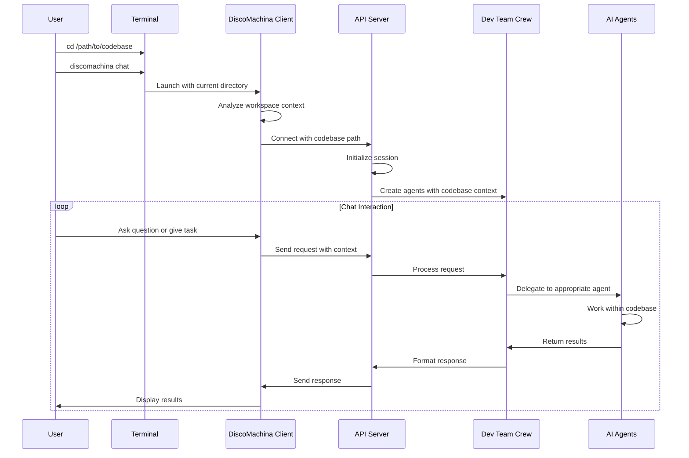

With this flow:
1. The user navigates to their project directory in the terminal
2. The DiscoMachina client automatically uses the current directory as the working context
3. All operations are contained within this codebase, ensuring isolation and safety
4. No additional setup or configuration is needed - "it just works"

## Core Flows

### 1. Terminal Client to API Server Flow

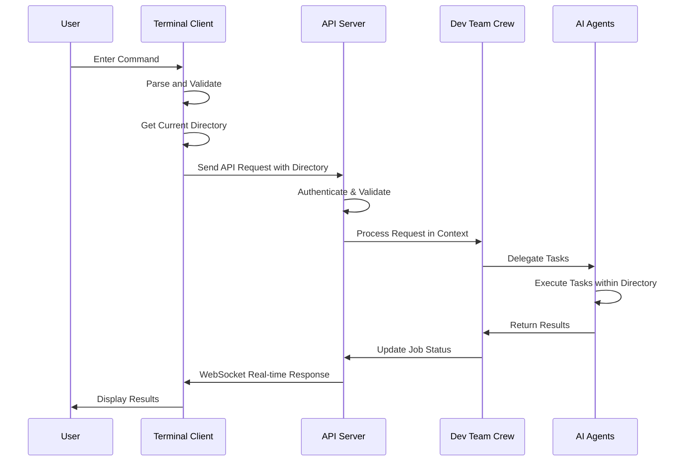

### 2. Project Creation Flow

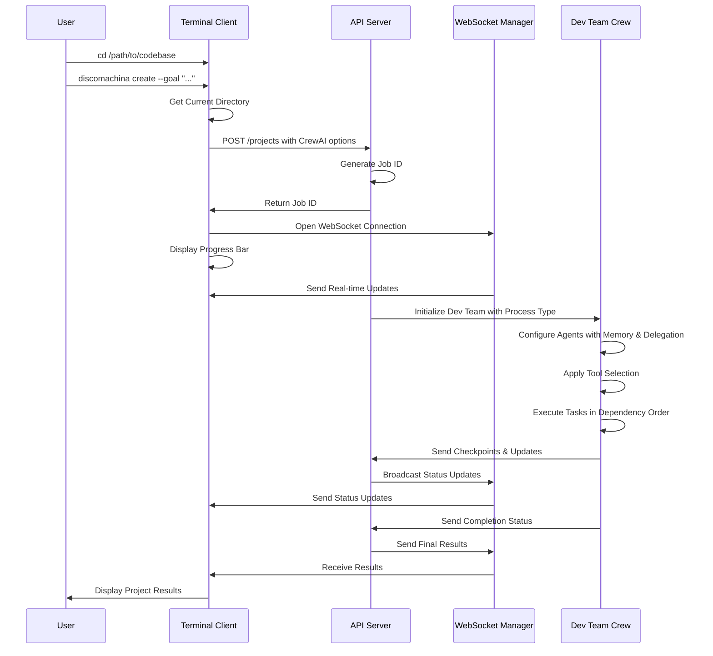

### 3. Agent Communication Flow

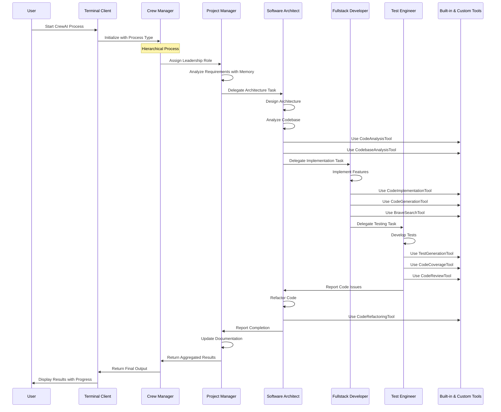

### 4. Task Execution Flow

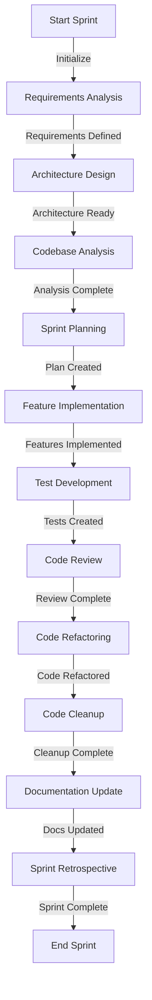

## Advanced Flows

### 5. Context Management Flow

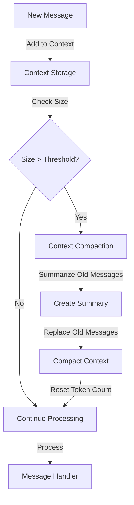

### 6. Tool Execution Flow

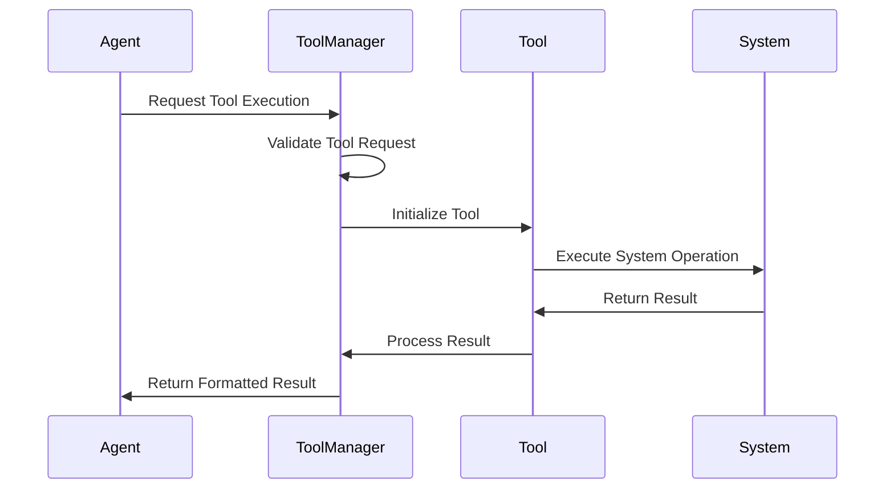

### 7. Error Recovery Flow

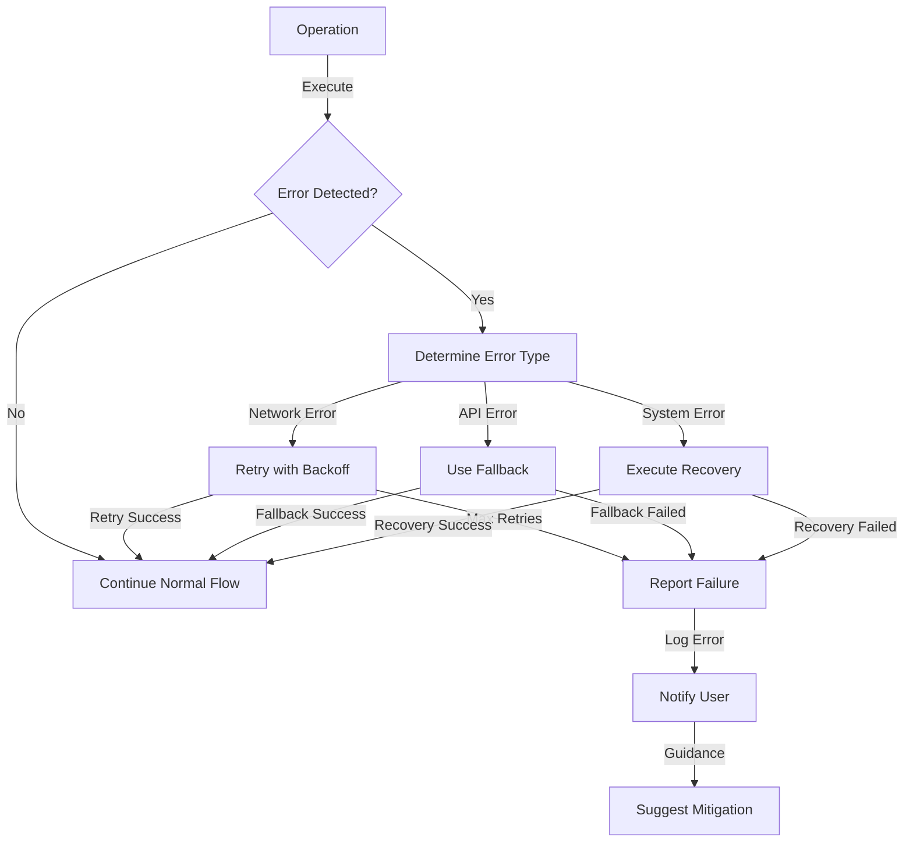

### 8. Offline Mode Flow

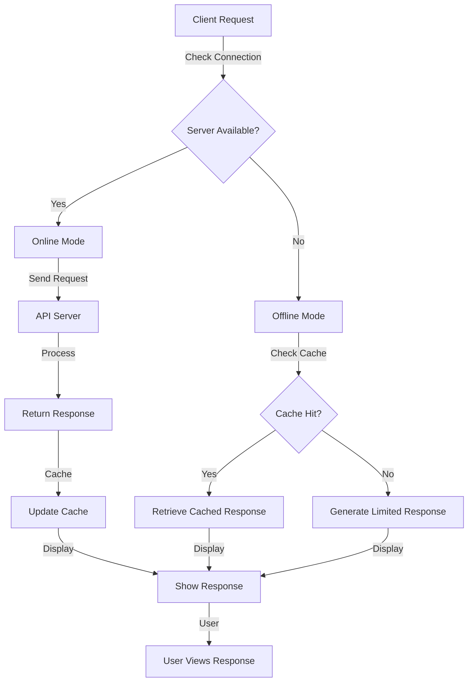

### 9. Working Directory Chat Flow

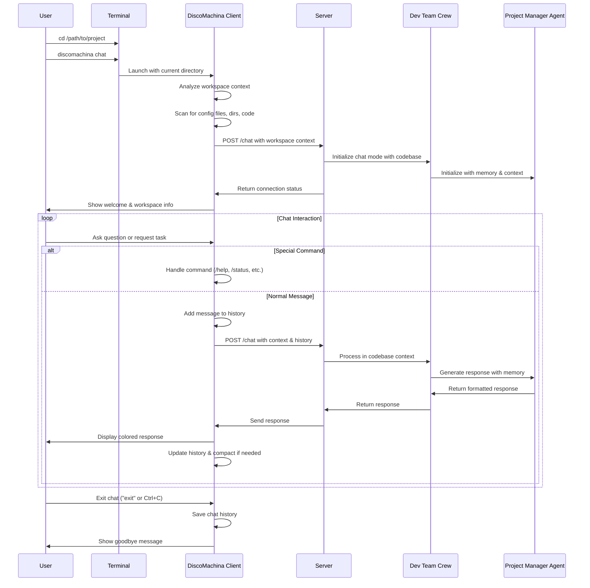

### 10. CrewAI Training and Testing Flow

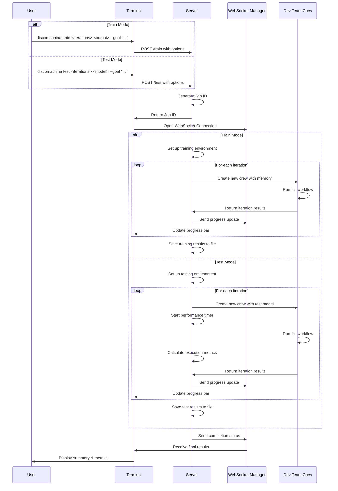

### 10. Job Monitoring Flow

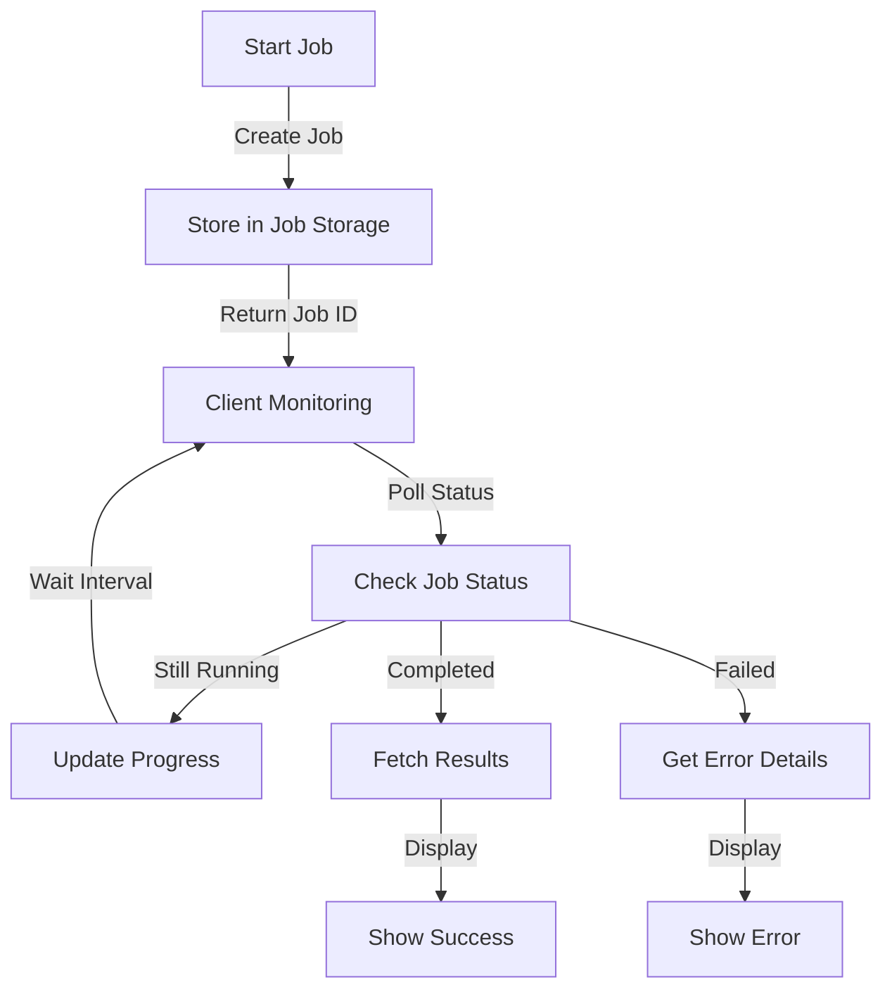

## Implementation Status

The following enhancements have been implemented to improve the DiscoMachina system:

✅ **Working Directory Based Operation**: System now automatically uses the current directory as working context
✅ **WebSocket for real-time updates**: Replaced polling with WebSocket connections for real-time job status updates
✅ **Checkpointing for long-running tasks**: Added task checkpointing for resilience against interruptions
✅ **Enhanced error recovery**: Implemented exponential backoff retries for network and API errors
✅ **Improved context management**: Enhanced context handling with better compaction strategies
✅ **Expanded CrewAI integration**: Added support for all CrewAI process types, memory, and delegation options
✅ **Enhanced tools integration**: Added support for both custom and built-in CrewAI tools
✅ **Training and testing capabilities**: Added support for training iterations and model testing

### Future Improvements

1. **Expand offline capabilities**: Cache more interactions and enable better offline functionality
2. **Implement proper authentication flow**: Add token-based authentication with refresh capabilities
3. **Add session persistence**: Allow users to resume sessions across client restarts
4. **Create better tool discovery mechanism**: Add dynamic tool discovery and registration
5. **Add support for multi-project workspaces**: Allow managing multiple projects simultaneously
6. **Implement user preferences**: Add support for user-specific preferences and settings