# DiscoMachina Technical Details

This document provides detailed technical information about the DiscoMachina system architecture, components, and implementation details.

## Key Enhancements

The following key enhancements have been implemented to improve the system's reliability, performance, and user experience:

1. **Working Directory Based Operation**: System now uses the current directory as working context
2. **CrewAI Integration**: Full support for all CrewAI process types, memory, and delegation options
3. **Real-time Updates with WebSockets**: Replaced polling-based monitoring with WebSocket connections for instant job status updates
4. **Improved Error Recovery**: Added exponential backoff retry mechanism for failed tasks
5. **Task Checkpointing**: Implemented checkpointing system to recover from interruptions
6. **Enhanced Context Management**: Improved context handling with smarter compaction
7. **Progress Tracking**: Added detailed progress tracking with visual indicators
8. **Graceful Degradation**: Enhanced offline mode with better caching and fallback options
9. **Training and Testing Capabilities**: Added support for training iterations and model testing

## CrewAI Integration

The DiscoMachina system has been fully integrated with CrewAI's latest features, providing a powerful framework for agent-based software development:

### Working Directory Based Operation

The system now automatically uses the user's current working directory as the context for all operations:

```bash
# Navigate to your project
cd /path/to/your/project

# Launch DiscoMachina chat mode
discomachina chat

# Or create a new project
discomachina create --goal "Analyze and refactor this codebase"
```

This approach has several advantages:
- No need for explicit directory specification
- All operations are contained within the codebase
- System automatically detects project structure and requirements
- Easier to use and more intuitive for developers

### Process Types

DiscoMachina supports all CrewAI process types:

1. **Hierarchical Process** (default)
   - Agents work in a hierarchical structure
   - Project Manager acts as team lead
   - Tasks can be delegated down the hierarchy
   - Enables complex dependency management
   - Example: `--process hierarchical`

2. **Sequential Process**
   - Agents work one after another
   - Simpler execution model for linear tasks
   - Good for debugging complex workflows
   - Example: `--process sequential`

3. **Parallel Process**
   - Agents work simultaneously on independent tasks
   - Faster execution for independent workloads
   - Good for analysis tasks across multiple domains
   - Example: `--process parallel`

### Memory and Context Management

DiscoMachina supports CrewAI's memory management features:

1. **Agent Memory**
   - Enabled by default, can be disabled with `--no-memory`
   - Provides context retention between agent interactions
   - Improves coherence in multi-step reasoning
   - Persists across task executions

2. **Context Management**
   - Smart context compaction with token tracking
   - Intelligent message summarization
   - Automatic history pruning with context preservation
   - Workspace-aware responses with state persistence

### Delegation Support

Agent delegation is a key feature of the hierarchical process:

1. **Enabled by default**
   - Can be disabled with `--no-delegation`
   - Allows agents to assign subtasks to other agents
   - Enables complex problem decomposition
   - Improves specialization and task allocation

2. **Delegation Flow**
   - Project Manager delegates high-level tasks
   - Software Architect delegates implementation tasks
   - Fullstack Developer delegates testing tasks
   - All results roll back up the chain

### Tool Integration and Selection

DiscoMachina supports both custom development tools and CrewAI's built-in tools:

1. **Custom Development Tools**
   - `RequirementsAnalysisTool`: Create detailed product backlogs
   - `CodeAnalysisTool`: Analyze code quality and structure
   - `CodeRefactoringTool`: Improve code structure and quality
   - `TestGenerationTool`: Create comprehensive test suites
   - `CodeReviewTool`: Review code against standards
   - And many more specialized development tools

2. **Built-in CrewAI Tools**
   - `BraveSearchTool`: Web search capabilities through Brave Search
   - `CodeDocsSearchTool`: Search within code documentation
   - `CodeInterpreterTool`: Execute Python code in a container
   - `FileReadTool`: Read file contents with error handling
   - `FileWriterTool`: Write to files with cross-platform support
   - `GithubSearchTool`: Search GitHub repositories

3. **Tool Selection**
   - Tools can be specified using the `--tools` parameter
   - Comma-separated list of tool names
   - Example: `--tools "CodeAnalysisTool,BraveSearchTool,CodeDocsSearchTool"`
   - Default: All tools are available to agents

4. **Tool Assignment**
   - Different tools are assigned to different agent roles
   - Project Manager: Requirements and planning tools
   - Software Architect: Code analysis and refactoring tools
   - Fullstack Developer: Implementation and generation tools
   - Test Engineer: Testing and quality assurance tools

### Training and Testing Features

DiscoMachina supports model training and testing for optimized performance:

1. **Training Mode**
   - Run multiple iterations to improve agent performance
   - Save training results to a specified file
   - Example: `discomachina train 3 results.json --goal "Create a REST API"`

2. **Testing Mode**
   - Test specific models for performance comparison
   - Evaluate different models on the same tasks
   - Example: `discomachina test 2 "claude-3-opus" --goal "Refactor code"`

3. **Model Performance Analysis**
   - Execution time and token usage metrics
   - Quality assessment of outputs
   - Comparative analysis between models
   - Performance recommendations

## System Architecture Details

### Terminal Client Architecture

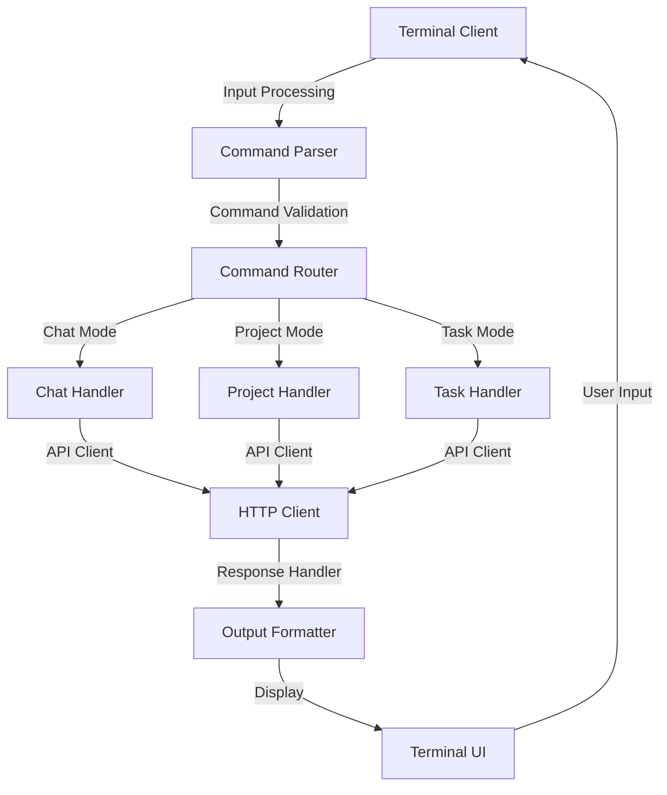
```mermaid
graph TD
    A[Terminal Client] -->|Input Processing| B[Command Parser]
    B -->|Command Validation| C[Command Router]
    C -->|Chat Mode| D[Chat Handler]
    C -->|Project Mode| E[Project Handler]
    C -->|Task Mode| F[Task Handler]
    D -->|API Client| G[HTTP Client]
    E -->|API Client| G
    F -->|API Client| G
    G -->|Response Handler| H[Output Formatter]
    H -->|Display| I[Terminal UI]
    I -->|User Input| A
```

### API Server Architecture

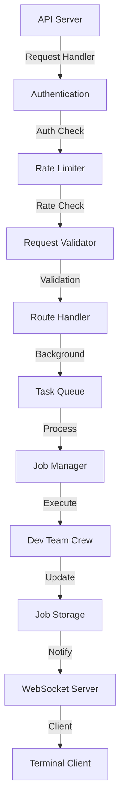
```mermaid
graph TD
    A[API Server] -->|Request Handler| B[Authentication]
    B -->|Auth Check| C[Rate Limiter]
    C -->|Rate Check| D[Request Validator]
    D -->|Validation| E[Route Handler]
    E -->|Background| F[Task Queue]
    F -->|Process| G[Job Manager]
    G -->|Execute| H[Dev Team Crew]
    H -->|Update| I[Job Storage]
    I -->|Notify| J[WebSocket Server]
    J -->|Client| K[Terminal Client]
```

### Development Team Architecture

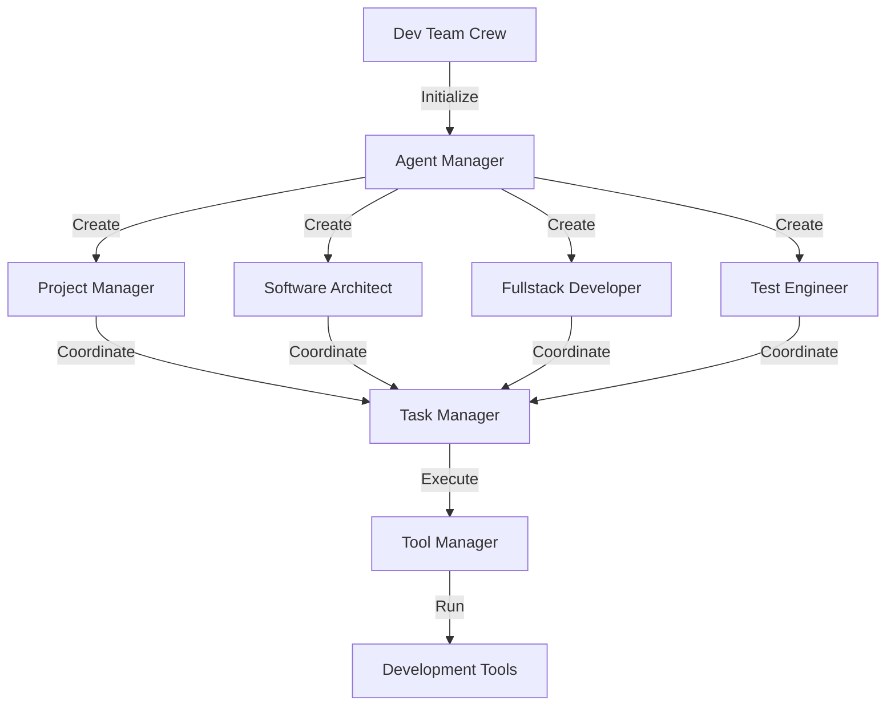
```mermaid
graph TD
    A[Dev Team Crew] -->|Initialize| B[Agent Manager]
    B -->|Create| C[Project Manager]
    B -->|Create| D[Software Architect]
    B -->|Create| E[Fullstack Developer]
    B -->|Create| F[Test Engineer]
    C -->|Coordinate| G[Task Manager]
    D -->|Coordinate| G
    E -->|Coordinate| G
    F -->|Coordinate| G
    G -->|Execute| H[Tool Manager]
    H -->|Run| I[Development Tools]
```

## Technical Implementation Details

### WebSocket-Based Real-Time Updates

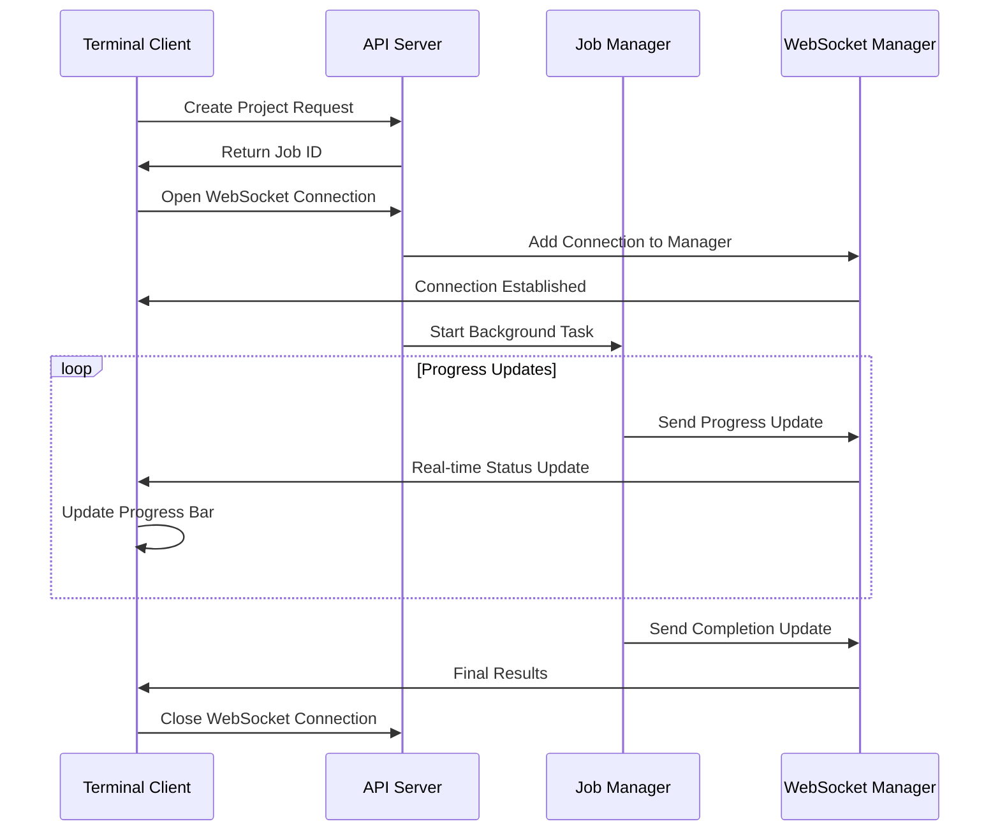
```mermaid
sequenceDiagram
    participant Client as Terminal Client
    participant Server as API Server
    participant JobManager as Job Manager
    participant WS as WebSocket Manager
    
    Client->>Server: Create Project Request
    Server->>Client: Return Job ID
    Client->>Server: Open WebSocket Connection
    Server->>WS: Add Connection to Manager
    WS->>Client: Connection Established
    Server->>JobManager: Start Background Task
    
    loop Progress Updates
        JobManager->>WS: Send Progress Update
        WS->>Client: Real-time Status Update
        Client->>Client: Update Progress Bar
    end
    
    JobManager->>WS: Send Completion Update
    WS->>Client: Final Results
    Client->>Server: Close WebSocket Connection
```

### Checkpointing and Recovery System

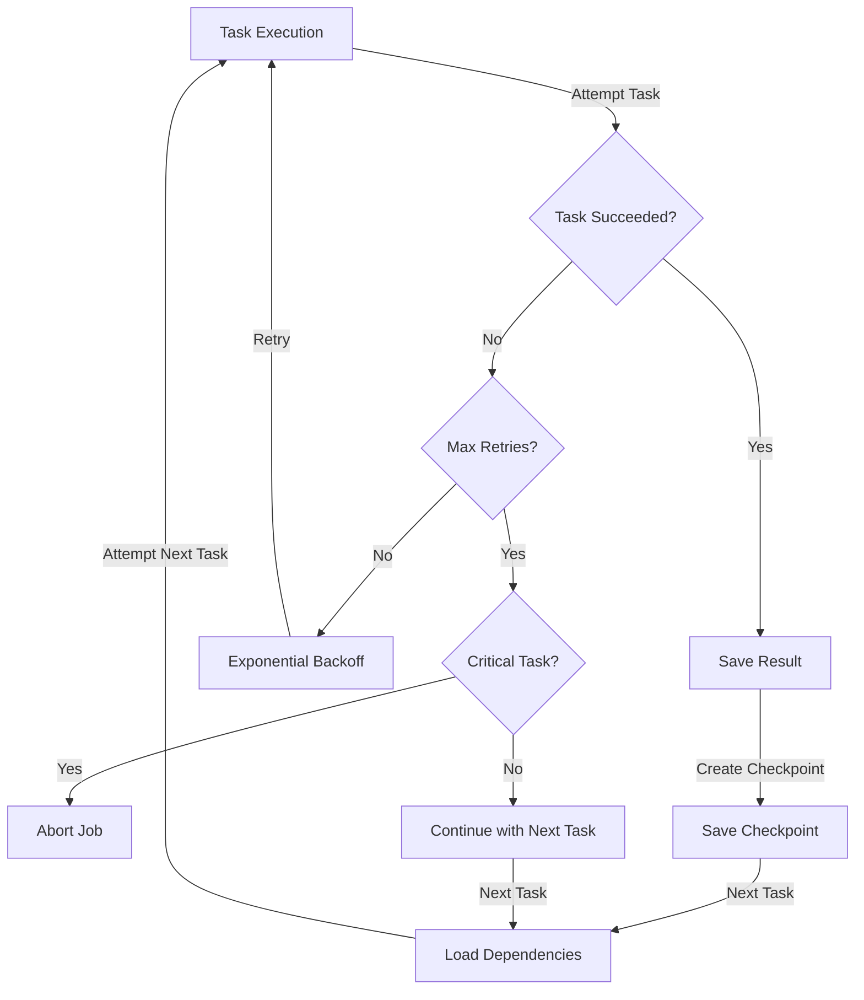
```mermaid
graph TD
    A[Task Execution] -->|Attempt Task| B{Task Succeeded?}
    B -->|Yes| C[Save Result]
    B -->|No| D{Max Retries?}
    D -->|No| E[Exponential Backoff]
    E -->|Retry| A
    D -->|Yes| F{Critical Task?}
    F -->|Yes| G[Abort Job]
    F -->|No| H[Continue with Next Task]
    C -->|Create Checkpoint| I[Save Checkpoint]
    I -->|Next Task| J[Load Dependencies]
    H -->|Next Task| J
    J -->|Attempt Next Task| A
```

### Agent Communication Protocol

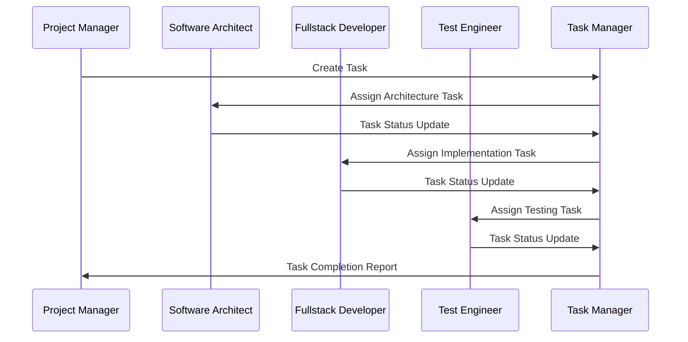
```mermaid
sequenceDiagram
    participant PM as Project Manager
    participant SA as Software Architect
    participant FD as Fullstack Developer
    participant TE as Test Engineer
    participant TM as Task Manager
    
    PM->>TM: Create Task
    TM->>SA: Assign Architecture Task
    SA->>TM: Task Status Update
    TM->>FD: Assign Implementation Task
    FD->>TM: Task Status Update
    TM->>TE: Assign Testing Task
    TE->>TM: Task Status Update
    TM->>PM: Task Completion Report
```

### Tool Integration Architecture

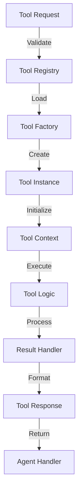
```mermaid
graph TD
    A[Tool Request] -->|Validate| B[Tool Registry]
    B -->|Load| C[Tool Factory]
    C -->|Create| D[Tool Instance]
    D -->|Initialize| E[Tool Context]
    E -->|Execute| F[Tool Logic]
    F -->|Process| G[Result Handler]
    G -->|Format| H[Tool Response]
    H -->|Return| I[Agent Handler]
```

### Context Management System

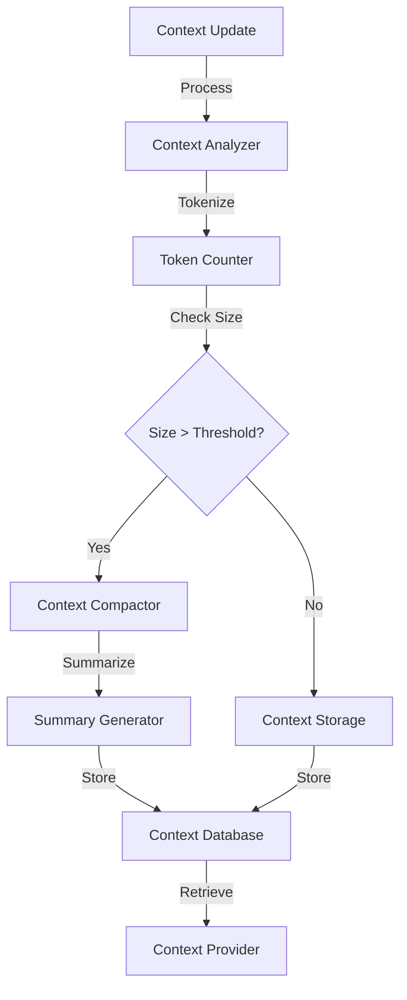
```mermaid
graph TD
    A[Context Update] -->|Process| B[Context Analyzer]
    B -->|Tokenize| C[Token Counter]
    C -->|Check Size| D{Size > Threshold?}
    D -->|Yes| E[Context Compactor]
    D -->|No| F[Context Storage]
    E -->|Summarize| G[Summary Generator]
    G -->|Store| H[Context Database]
    F -->|Store| H
    H -->|Retrieve| I[Context Provider]
```

## Additional Flow Charts

### Code Generation Flow

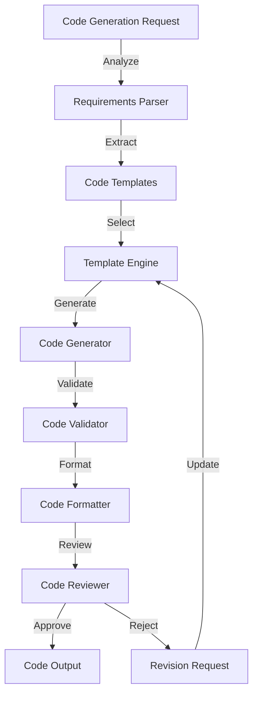
```mermaid
graph TD
    A[Code Generation Request] -->|Analyze| B[Requirements Parser]
    B -->|Extract| C[Code Templates]
    C -->|Select| D[Template Engine]
    D -->|Generate| E[Code Generator]
    E -->|Validate| F[Code Validator]
    F -->|Format| G[Code Formatter]
    G -->|Review| H[Code Reviewer]
    H -->|Approve| I[Code Output]
    H -->|Reject| J[Revision Request]
    J -->|Update| D
```

### Test Generation Flow

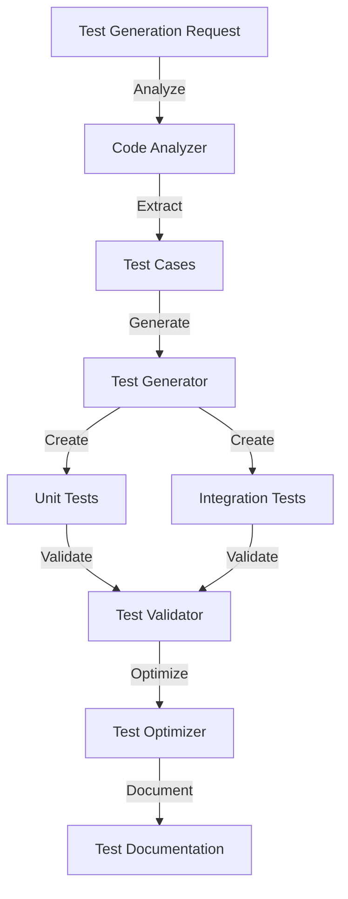
```mermaid
graph TD
    A[Test Generation Request] -->|Analyze| B[Code Analyzer]
    B -->|Extract| C[Test Cases]
    C -->|Generate| D[Test Generator]
    D -->|Create| E[Unit Tests]
    D -->|Create| F[Integration Tests]
    E -->|Validate| G[Test Validator]
    F -->|Validate| G
    G -->|Optimize| H[Test Optimizer]
    H -->|Document| I[Test Documentation]
```

### Performance Monitoring Flow

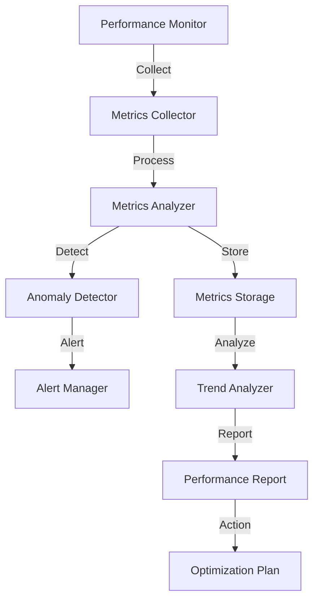
```mermaid
graph TD
    A[Performance Monitor] -->|Collect| B[Metrics Collector]
    B -->|Process| C[Metrics Analyzer]
    C -->|Detect| D[Anomaly Detector]
    D -->|Alert| E[Alert Manager]
    C -->|Store| F[Metrics Storage]
    F -->|Analyze| G[Trend Analyzer]
    G -->|Report| H[Performance Report]
    H -->|Action| I[Optimization Plan]
```

### Security Monitoring Flow

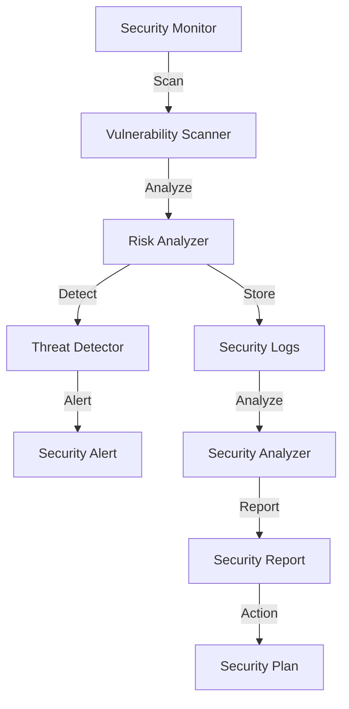
```mermaid
graph TD
    A[Security Monitor] -->|Scan| B[Vulnerability Scanner]
    B -->|Analyze| C[Risk Analyzer]
    C -->|Detect| D[Threat Detector]
    D -->|Alert| E[Security Alert]
    C -->|Store| F[Security Logs]
    F -->|Analyze| G[Security Analyzer]
    G -->|Report| H[Security Report]
    H -->|Action| I[Security Plan]
```

### Dependency Analysis Flow

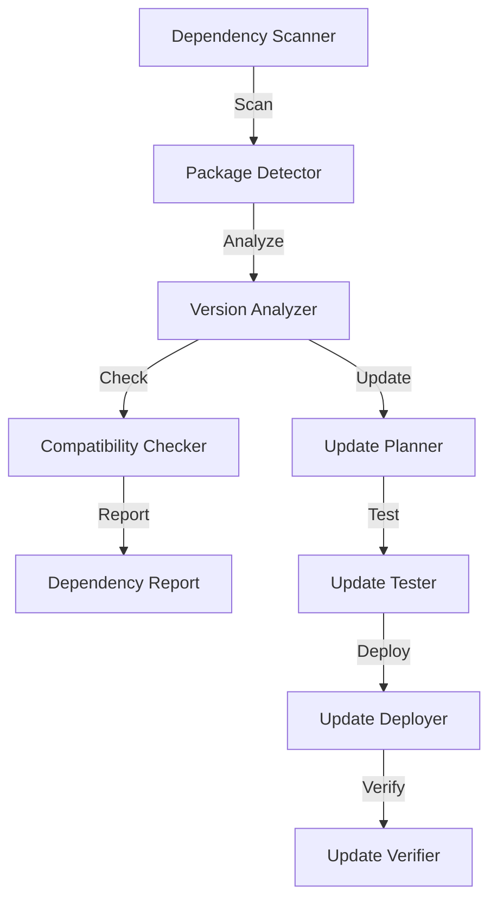
```mermaid
graph TD
    A[Dependency Scanner] -->|Scan| B[Package Detector]
    B -->|Analyze| C[Version Analyzer]
    C -->|Check| D[Compatibility Checker]
    D -->|Report| E[Dependency Report]
    C -->|Update| F[Update Planner]
    F -->|Test| G[Update Tester]
    G -->|Deploy| H[Update Deployer]
    H -->|Verify| I[Update Verifier]
```

### Documentation Generation Flow

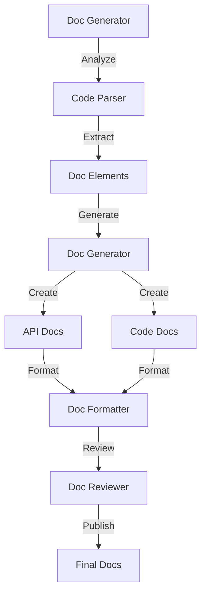
```mermaid
graph TD
    A[Doc Generator] -->|Analyze| B[Code Parser]
    B -->|Extract| C[Doc Elements]
    C -->|Generate| D[Doc Generator]
    D -->|Create| E[API Docs]
    D -->|Create| F[Code Docs]
    E -->|Format| G[Doc Formatter]
    F -->|Format| G
    G -->|Review| H[Doc Reviewer]
    H -->|Publish| I[Final Docs]
```

## Technical Specifications

### API Endpoints

#### Projects
```yaml
POST /projects:
  request:
    project_goal: string
    codebase_dir: string
    non_interactive: boolean
    process_type: string  # "sequential", "parallel", "hierarchical"
    model: string         # Optional model name
    memory: boolean       # Whether to enable memory
    tools: string         # Tool list or "all"
    delegation: boolean   # Whether to enable delegation
  response:
    job_id: string
    status: string
    message: string

GET /projects:
  response:
    projects: array
      - job_id: string
        project_goal: string
        status: string
        created_at: string
        updated_at: string
        process_type: string
        memory_enabled: boolean

GET /projects/{job_id}:
  response:
    job_id: string
    project_goal: string
    status: string
    result: object
    created_at: string
    updated_at: string
    process_type: string
    memory_enabled: boolean
    tools: string
```

#### Tasks
```yaml
POST /tasks/replay:
  request:
    task_index: integer
    process_type: string  # "sequential", "parallel", "hierarchical"
    model: string         # Optional model name
    memory: boolean       # Whether to enable memory
    tools: string         # Tool list or "all"
    verbose: boolean      # Whether to enable verbose output
    with_delegation: boolean  # Whether to enable delegation
  response:
    job_id: string
    status: string
    message: string
    task_index: integer
    process_type: string
    memory_enabled: boolean
```

#### Training & Testing
```yaml
POST /train:
  request:
    project_goal: string
    codebase_dir: string
    iterations: integer
    output_file: string
    process_type: string  # "sequential", "parallel", "hierarchical"
    model: string         # Optional model name
    memory: boolean       # Whether to enable memory
    tools: string         # Tool list or "all"
  response:
    job_id: string
    status: string
    message: string
    iterations: integer
    output_file: string

POST /test:
  request:
    project_goal: string
    codebase_dir: string
    iterations: integer
    model: string
    process_type: string  # "sequential", "parallel", "hierarchical"
    memory: boolean       # Whether to enable memory
    tools: string         # Tool list or "all" 
  response:
    job_id: string
    status: string
    message: string
    iterations: integer
    model: string
```

#### Memory
```yaml
POST /memory/reset:
  request:
    memory_type: string
  response:
    status: string
    message: string
    result: object
```

#### Chat
```yaml
POST /chat:
  request:
    messages: array
      - role: string
        content: string
    model: string
    workspace_context: object
    current_dir: string
    memory: boolean       # Whether to enable agent memory
  response:
    response: string
    context: object
```

#### WebSockets
```yaml
WebSocket /ws/{job_id}:
  messages:
    - job_id: string
      status: string      # "initializing", "setting_up", "running", "completed", "failed" 
      message: string
      progress: integer   # 0-100 percent
      result: object      # Present when complete
      error: string       # Present when failed
      timestamp: string
```

### Development Tools

#### Requirements Analysis Tool
```python
def requirements_analysis_tool(input_text: str) -> str:
    """
    Analyze project requirements and create a detailed product backlog.
    
    Args:
        input_text (str): Project requirements and context
        
    Returns:
        str: Analysis results and recommendations
    """
```

#### Code Analysis Tool
```python
def code_analysis_tool(input_text: str) -> str:
    """
    Analyze code quality, complexity, and structure.
    
    Args:
        input_text (str): Code to analyze
        
    Returns:
        str: Analysis results and recommendations
    """
```

#### Test Generation Tool
```python
def test_generation_tool(input_text: str) -> str:
    """
    Generate unit, integration, and end-to-end tests.
    
    Args:
        input_text (str): Code to generate tests for
        
    Returns:
        str: Generated tests and documentation
    """
```

### Agent Configurations

#### Project Manager
```yaml
project_manager:
  role: "Project Manager"
  goal: "Analyze requirements, create sprint plans, coordinate team"
  backstory: "Experienced in Agile methodologies and software development"
  tools:
    - "RequirementsAnalysisTool"
    - "TaskTrackingTool"
    - "AgileProjectManagementTool"
  verbose: true
```

#### Software Architect
```yaml
software_architect:
  role: "Software Architect"
  goal: "Design system architecture, analyze code structure"
  backstory: "Expert in software design patterns and architectural principles"
  tools:
    - "CodeAnalysisTool"
    - "CodebaseAnalysisTool"
    - "CodeRefactoringTool"
  verbose: true
```

### Task Configurations

#### Requirements Analysis
```yaml
requirements_analysis:
  description: "Analyze project requirements and create product backlog"
  agent: "project_manager"
  dependencies: []
  tools:
    - "RequirementsAnalysisTool"
    - "TaskTrackingTool"
```

#### Architecture Design
```yaml
architecture_design:
  description: "Design system components and data flow"
  agent: "software_architect"
  dependencies: ["requirements_analysis"]
  tools:
    - "CodeAnalysisTool"
    - "CodebaseAnalysisTool"
```

## Performance Considerations

### Caching Strategy
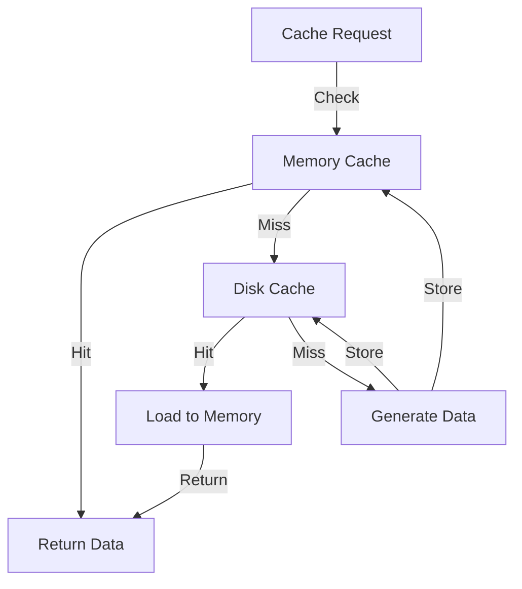
```mermaid
graph TD
    A[Cache Request] -->|Check| B[Memory Cache]
    B -->|Hit| C[Return Data]
    B -->|Miss| D[Disk Cache]
    D -->|Hit| E[Load to Memory]
    D -->|Miss| F[Generate Data]
    E -->|Return| C
    F -->|Store| B
    F -->|Store| D
```

### Resource Management
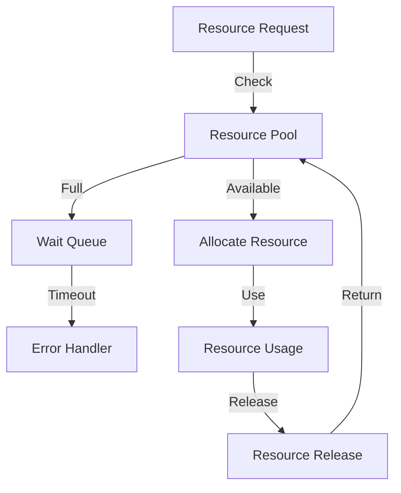
```mermaid
graph TD
    A[Resource Request] -->|Check| B[Resource Pool]
    B -->|Available| C[Allocate Resource]
    B -->|Full| D[Wait Queue]
    D -->|Timeout| E[Error Handler]
    C -->|Use| F[Resource Usage]
    F -->|Release| G[Resource Release]
    G -->|Return| B
```

## Security Considerations

### Authentication Flow
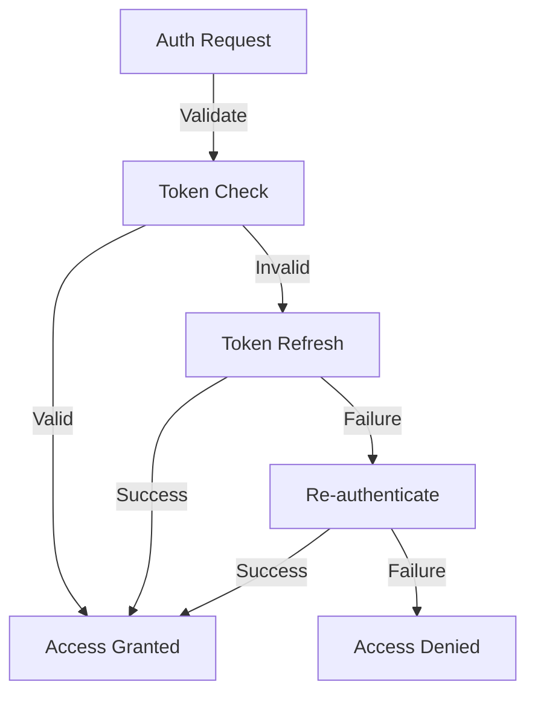
```mermaid
graph TD
    A[Auth Request] -->|Validate| B[Token Check]
    B -->|Valid| C[Access Granted]
    B -->|Invalid| D[Token Refresh]
    D -->|Success| C
    D -->|Failure| E[Re-authenticate]
    E -->|Success| C
    E -->|Failure| F[Access Denied]
```

### Authorization Flow
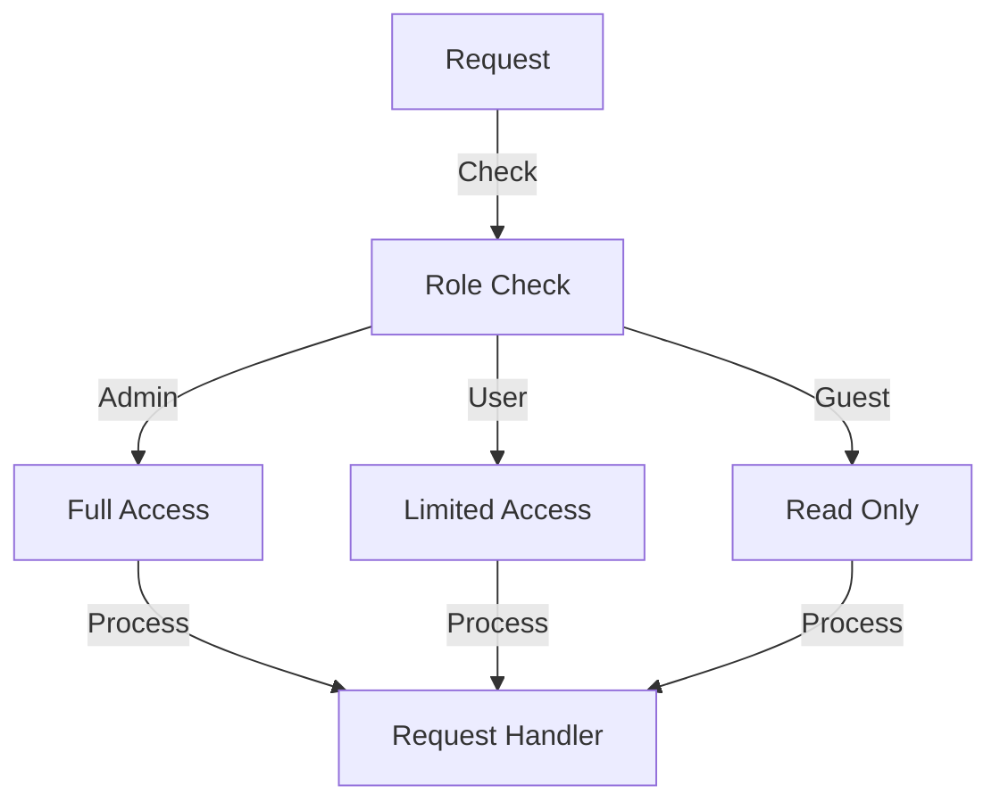
```mermaid
graph TD
    A[Request] -->|Check| B[Role Check]
    B -->|Admin| C[Full Access]
    B -->|User| D[Limited Access]
    B -->|Guest| E[Read Only]
    C -->|Process| F[Request Handler]
    D -->|Process| F
    E -->|Process| F
```

## Error Handling

### Improved Error Recovery Flow

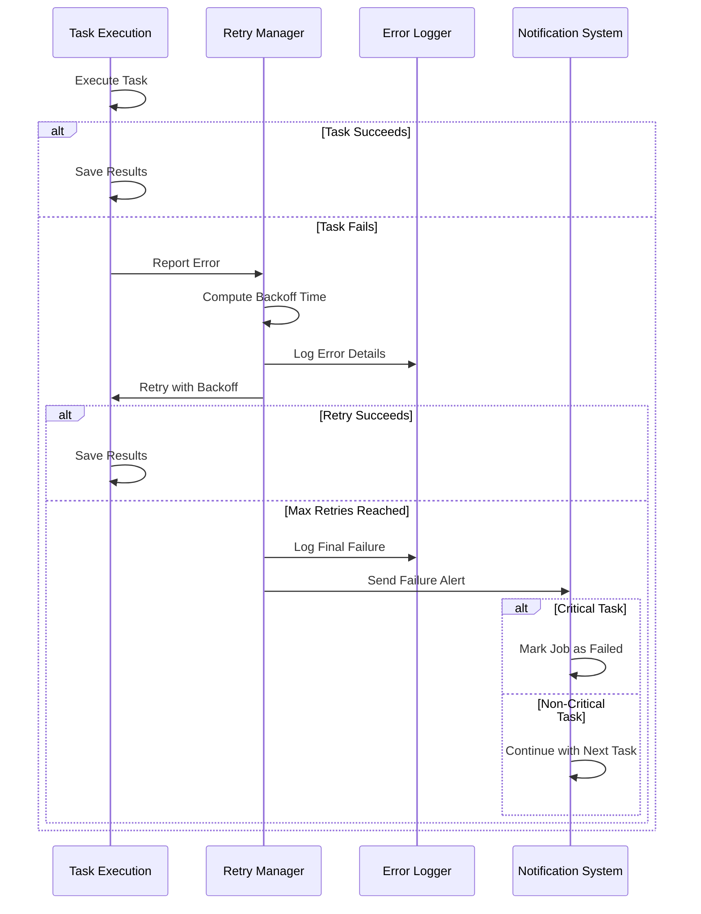
```mermaid
sequenceDiagram
    participant Task as Task Execution
    participant Retry as Retry Manager
    participant Logger as Error Logger
    participant Notify as Notification System
    
    Task->>Task: Execute Task
    
    alt Task Succeeds
        Task->>Task: Save Results
    else Task Fails
        Task->>Retry: Report Error
        Retry->>Retry: Compute Backoff Time
        Retry->>Logger: Log Error Details
        Retry->>Task: Retry with Backoff
        
        alt Retry Succeeds
            Task->>Task: Save Results
        else Max Retries Reached
            Retry->>Logger: Log Final Failure
            Retry->>Notify: Send Failure Alert
            
            alt Critical Task
                Notify->>Notify: Mark Job as Failed
            else Non-Critical Task
                Notify->>Notify: Continue with Next Task
            end
        end
    end
```

### Error Recovery Implementation

```python
# Execute task with retry logic
max_retries = 3
retry_count = 0
last_error = None

while retry_count < max_retries:
    try:
        # Execute task
        result = self.crew.kickoff()
        
        # Success - save results and exit retry loop
        task_outputs[task_id] = result
        completed_tasks.append(task_id)
        self._save_checkpoint(checkpoints_dir, task_outputs, completed_tasks)
        break
        
    except Exception as e:
        retry_count += 1
        last_error = e
        backoff_time = 2 ** retry_count  # Exponential backoff
        
        logger.warning(f"Task {task_id} failed (attempt {retry_count}/{max_retries}): {str(e)}")
        logger.info(f"Retrying in {backoff_time} seconds...")
        
        time.sleep(backoff_time)

# If all retries failed, handle based on task criticality
if retry_count == max_retries and last_error:
    if task_id in ["requirements_analysis", "architecture_design"]:
        # Critical tasks cause job failure
        raise Exception(f"Critical task {task_id} failed: {str(last_error)}")
    else:
        # Non-critical tasks allow continuing
        logger.warning(f"Continuing despite failure of task {task_id}")
```

### Original Error Recovery Flow
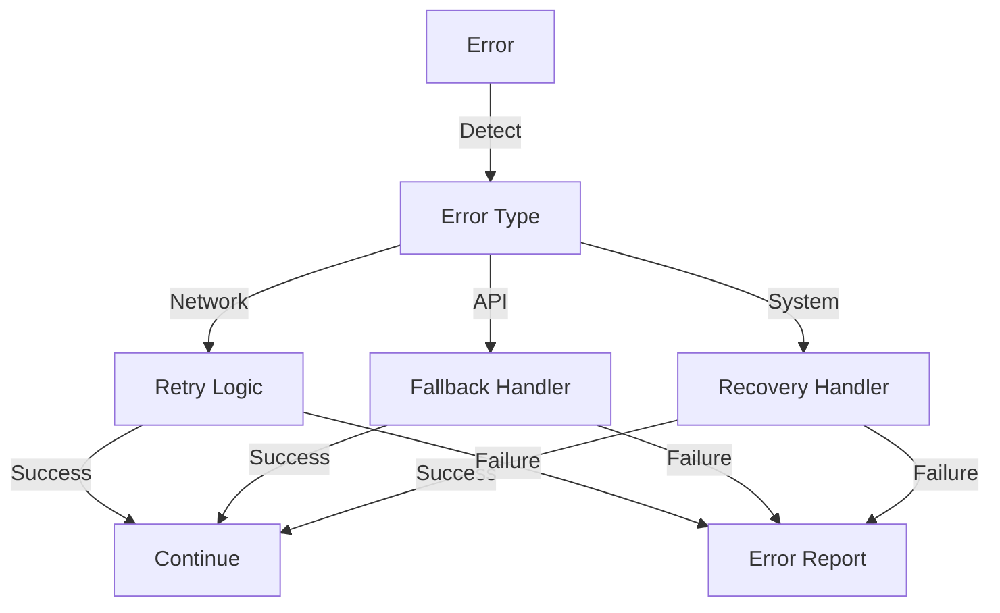
```mermaid
graph TD
    A[Error] -->|Detect| B[Error Type]
    B -->|Network| C[Retry Logic]
    B -->|API| D[Fallback Handler]
    B -->|System| E[Recovery Handler]
    C -->|Success| F[Continue]
    D -->|Success| F
    E -->|Success| F
    C -->|Failure| G[Error Report]
    D -->|Failure| G
    E -->|Failure| G
```

### Logging System
```mermaid
graph TD
    A[Log Event] -->|Process| B[Log Parser]
    B -->|Classify| C[Log Classifier]
    C -->|Store| D[Log Storage]
    C -->|Alert| E[Alert System]
    D -->|Analyze| F[Log Analyzer]
    F -->|Report| G[Log Report]
```

## Monitoring and Metrics

### Metrics Collection
```mermaid
graph TD
    A[Metric Event] -->|Collect| B[Metrics Collector]
    B -->|Process| C[Metrics Processor]
    C -->|Store| D[Time Series DB]
    C -->|Alert| E[Alert Manager]
    D -->|Analyze| F[Metrics Analyzer]
    F -->|Visualize| G[Dashboard]
```

### Health Monitoring
```mermaid
graph TD
    A[Health Check] -->|Monitor| B[System Health]
    B -->|Check| C[Component Status]
    C -->|Report| D[Health Report]
    C -->|Alert| E[Health Alert]
    D -->|Update| F[Status Dashboard]
    E -->|Notify| G[Alert System]
``` 