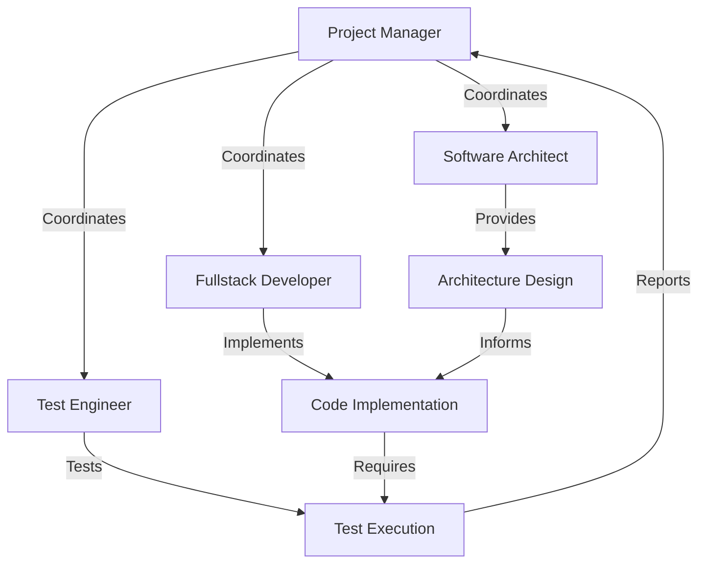
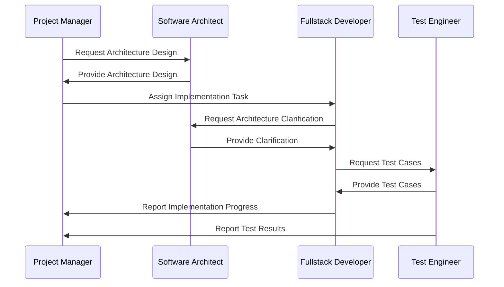
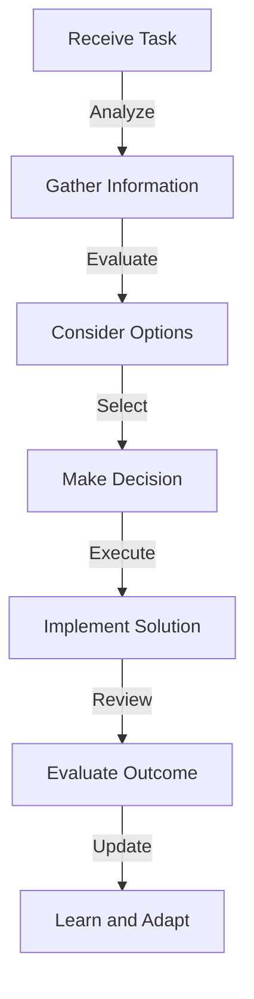
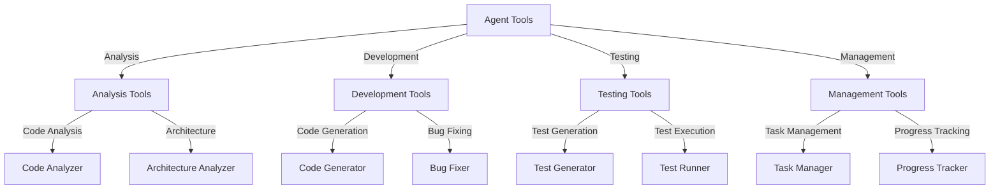
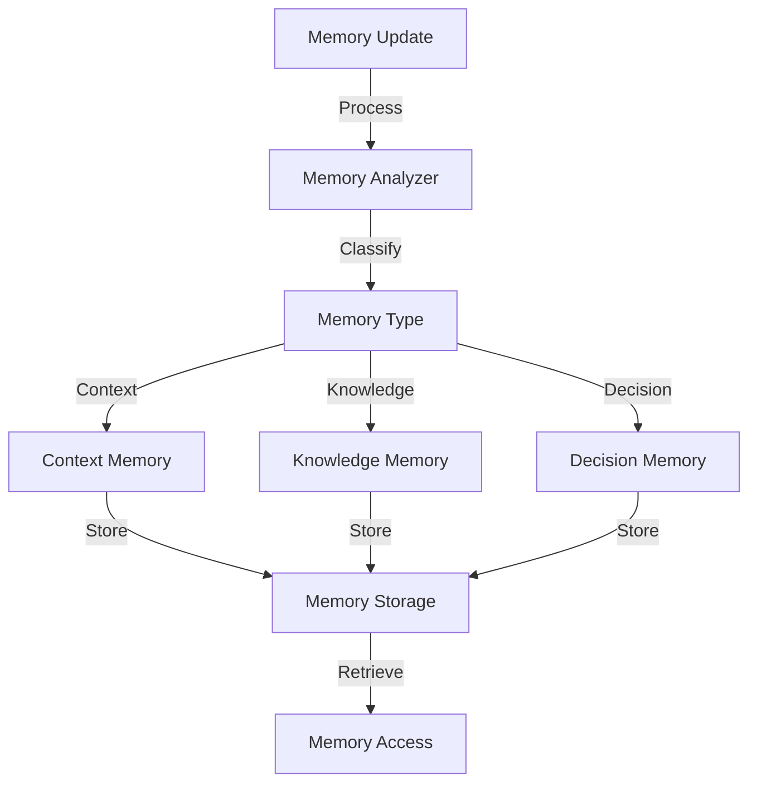
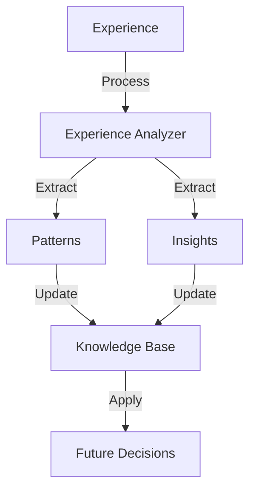
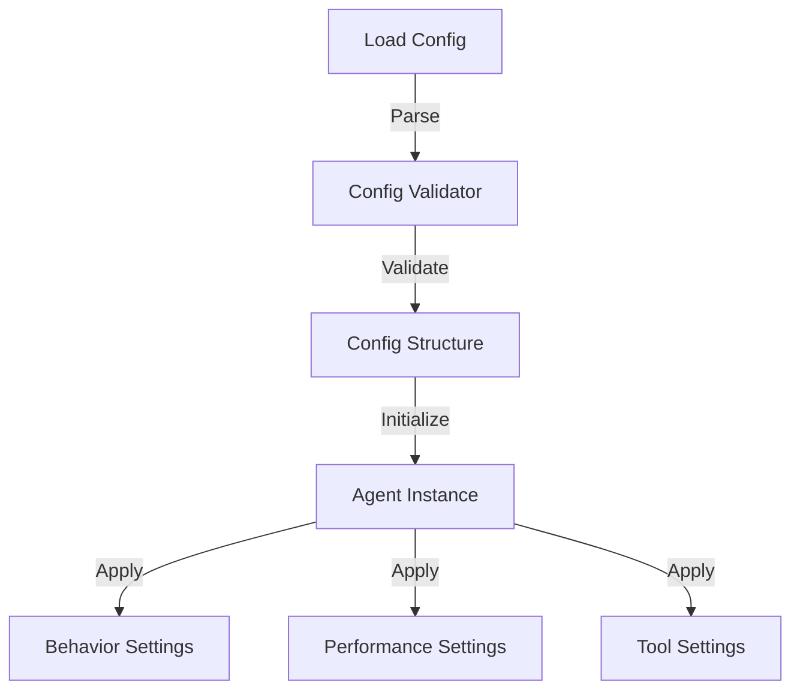

# DiscoMachina Agent System

## Overview

DiscoMachina implements a hierarchical team structure with specialized AI agents working together to handle various aspects of software development. This document details the agent system architecture, agent roles, and their interactions.

## Agent Hierarchy



## Agent Roles

### 1. Project Manager

```python
class ProjectManager:
    """
    Project Manager Agent
    
    Role: Coordinates project activities and manages the development team.
    
    Responsibilities:
    - Project planning and scheduling
    - Task assignment and tracking
    - Risk management
    - Team coordination
    - Progress monitoring
    - Quality assurance
    """
    
    def __init__(self, config: Dict):
        self.role = "project_manager"
        self.goals = [
            "Ensure project success",
            "Maintain team productivity",
            "Manage project risks",
            "Ensure quality deliverables"
        ]
        self.backstory = """
        Experienced project manager with expertise in software development
        methodologies and team management. Skilled in coordinating complex
        projects and ensuring successful delivery.
        """
        self.tools = [
            "task_manager",
            "risk_analyzer",
            "progress_tracker",
            "team_coordinator"
        ]
```

### 2. Software Architect

```python
class SoftwareArchitect:
    """
    Software Architect Agent
    
    Role: Designs and maintains the software architecture.
    
    Responsibilities:
    - Architecture design
    - Technology selection
    - Design patterns implementation
    - Code organization
    - Technical decisions
    - Architecture reviews
    """
    
    def __init__(self, config: Dict):
        self.role = "software_architect"
        self.goals = [
            "Design robust architecture",
            "Ensure scalability",
            "Maintain code quality",
            "Optimize performance"
        ]
        self.backstory = """
        Senior software architect with extensive experience in designing
        scalable and maintainable systems. Expert in various architectural
        patterns and best practices.
        """
        self.tools = [
            "architecture_designer",
            "pattern_analyzer",
            "code_organizer",
            "tech_selector"
        ]
```

### 3. Fullstack Developer

```python
class FullstackDeveloper:
    """
    Fullstack Developer Agent
    
    Role: Implements features and maintains code quality.
    
    Responsibilities:
    - Feature implementation
    - Code maintenance
    - Bug fixing
    - Code optimization
    - Documentation
    - Code reviews
    """
    
    def __init__(self, config: Dict):
        self.role = "fullstack_developer"
        self.goals = [
            "Implement features correctly",
            "Maintain code quality",
            "Fix bugs efficiently",
            "Optimize performance"
        ]
        self.backstory = """
        Experienced fullstack developer proficient in multiple programming
        languages and frameworks. Skilled in writing clean, efficient, and
        maintainable code.
        """
        self.tools = [
            "code_generator",
            "bug_fixer",
            "optimizer",
            "documenter"
        ]
```

### 4. Test Engineer

```python
class TestEngineer:
    """
    Test Engineer Agent
    
    Role: Ensures software quality through testing.
    
    Responsibilities:
    - Test planning
    - Test implementation
    - Test execution
    - Bug reporting
    - Quality metrics
    - Test automation
    """
    
    def __init__(self, config: Dict):
        self.role = "test_engineer"
        self.goals = [
            "Ensure software quality",
            "Maintain test coverage",
            "Identify bugs early",
            "Automate testing"
        ]
        self.backstory = """
        Experienced test engineer with expertise in various testing
        methodologies and automation tools. Skilled in ensuring software
        quality and reliability.
        """
        self.tools = [
            "test_generator",
            "test_runner",
            "coverage_analyzer",
            "bug_reporter"
        ]
```

## Agent Communication

### 1. Message Format

```python
class AgentMessage:
    """
    Standard message format for agent communication.
    """
    
    def __init__(self):
        self.sender: str
        self.receiver: str
        self.message_type: str
        self.content: Dict
        self.timestamp: datetime
        self.priority: str
        self.context: Dict
```

### 2. Communication Flow



## Agent Decision Making

### 1. Decision Process



### 2. Decision Factors

```python
class DecisionFactors:
    """
    Factors considered in agent decision making.
    """
    
    def __init__(self):
        self.technical_factors = [
            "Code quality",
            "Performance",
            "Scalability",
            "Maintainability"
        ]
        self.project_factors = [
            "Timeline",
            "Resources",
            "Dependencies",
            "Risks"
        ]
        self.quality_factors = [
            "Test coverage",
            "Bug count",
            "Code complexity",
            "Documentation"
        ]
```

## Agent Tools

### 1. Tool Integration

```python
class AgentTool:
    """
    Base class for agent tools.
    """
    
    def __init__(self):
        self.tool_id: str
        self.name: str
        self.description: str
        self.parameters: Dict
        self.return_type: str
        self.error_handling: Dict
```

### 2. Tool Categories



## Agent Memory

### 1. Memory Types

```python
class AgentMemory:
    """
    Memory management for agents.
    """
    
    def __init__(self):
        self.context_memory = {
            "project_context": Dict,
            "task_context": Dict,
            "team_context": Dict
        }
        self.knowledge_memory = {
            "technical_knowledge": Dict,
            "domain_knowledge": Dict,
            "best_practices": Dict
        }
        self.decision_memory = {
            "past_decisions": List,
            "outcomes": List,
            "learnings": List
        }
```

### 2. Memory Management



## Agent Learning

### 1. Learning Process



### 2. Learning Types

```python
class AgentLearning:
    """
    Learning mechanisms for agents.
    """
    
    def __init__(self):
        self.experiential_learning = {
            "task_outcomes": List,
            "decision_results": List,
            "team_interactions": List
        }
        self.knowledge_learning = {
            "technical_updates": List,
            "best_practices": List,
            "pattern_recognition": List
        }
        self.adaptive_learning = {
            "behavior_adjustments": List,
            "strategy_updates": List,
            "performance_improvements": List
        }
```

## Agent Configuration

### 1. Configuration Structure

```python
class AgentConfig:
    """
    Configuration for agent initialization.
    """
    
    def __init__(self):
        self.role_config = {
            "role": str,
            "goals": List[str],
            "backstory": str,
            "tools": List[str]
        }
        self.behavior_config = {
            "decision_style": str,
            "communication_style": str,
            "learning_rate": float
        }
        self.performance_config = {
            "quality_threshold": float,
            "efficiency_target": float,
            "response_time": int
        }
```

### 2. Configuration Management



## Best Practices

1. **Agent Design**
   - Clear role definition
   - Specific responsibilities
   - Well-defined goals
   - Appropriate tools

2. **Communication**
   - Standard message format
   - Clear protocols
   - Efficient routing
   - Error handling

3. **Decision Making**
   - Structured process
   - Consider all factors
   - Document decisions
   - Learn from outcomes

4. **Tool Integration**
   - Standard interface
   - Error handling
   - Performance monitoring
   - Version control

5. **Memory Management**
   - Efficient storage
   - Quick retrieval
   - Context awareness
   - Regular cleanup

6. **Learning System**
   - Continuous learning
   - Pattern recognition
   - Knowledge updates
   - Performance improvement

7. **Configuration**
   - Clear structure
   - Validation
   - Version control
   - Environment support

8. **Security**
   - Access control
   - Data protection
   - Audit logging
   - Compliance 