# DiscoMachina System Architecture

## Overview

DiscoMachina is a self-contained terminal client that provides intelligent codebase analysis and development assistance. It implements a hierarchical team structure with specialized AI agents working together to handle various aspects of software development.

## System Components

### 1. Terminal Client

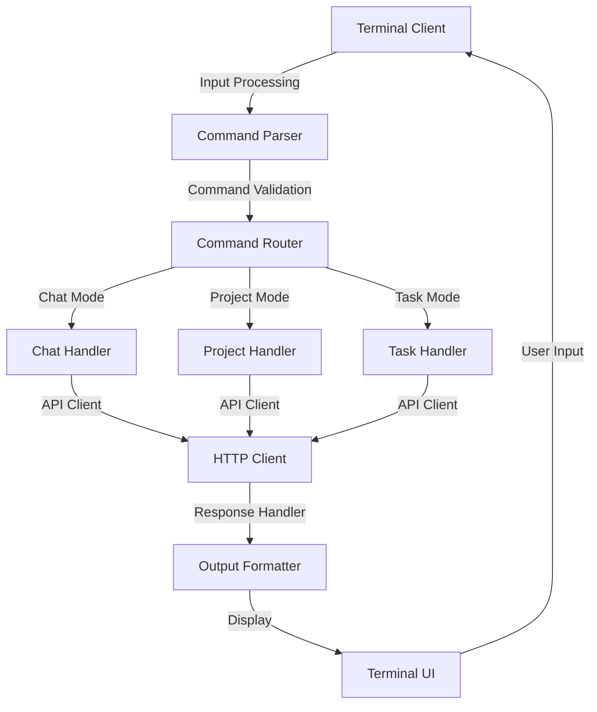

#### Components
- **Command Parser**: Parses and validates user input
- **Command Router**: Routes commands to appropriate handlers
- **Chat Handler**: Manages chat interactions
- **Project Handler**: Manages project operations
- **Task Handler**: Manages task execution
- **HTTP Client**: Handles API communication
- **Output Formatter**: Formats responses for display
- **Terminal UI**: Manages user interface

### 2. API Server

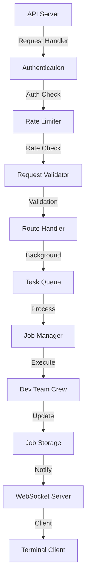

#### Components
- **Authentication**: Handles user authentication
- **Rate Limiter**: Manages API request rates
- **Request Validator**: Validates incoming requests
- **Route Handler**: Routes requests to handlers
- **Task Queue**: Manages background tasks
- **Job Manager**: Manages job execution
- **Job Storage**: Stores job data
- **WebSocket Server**: Handles real-time updates

### 3. Development Team

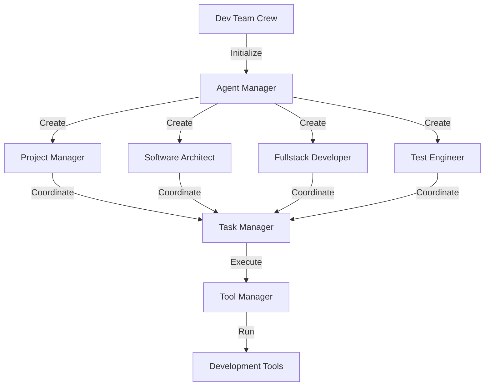

#### Components
- **Agent Manager**: Manages AI agents
- **Project Manager**: Coordinates project activities
- **Software Architect**: Handles architecture design
- **Fullstack Developer**: Implements features
- **Test Engineer**: Manages testing
- **Task Manager**: Coordinates tasks
- **Tool Manager**: Manages development tools

## Component Interactions

### 1. Command Flow
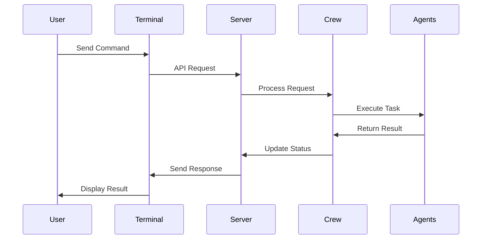

### 2. Agent Communication
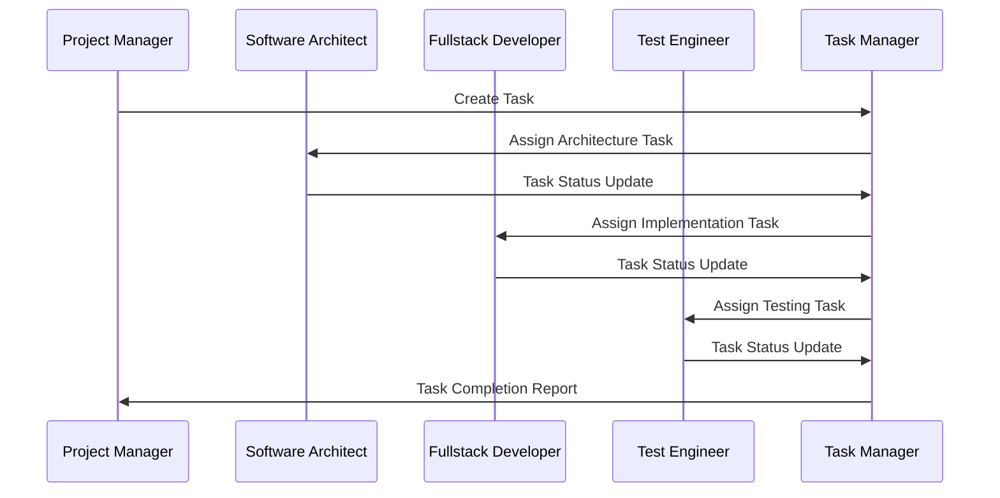

## Data Flow

### 1. Context Management
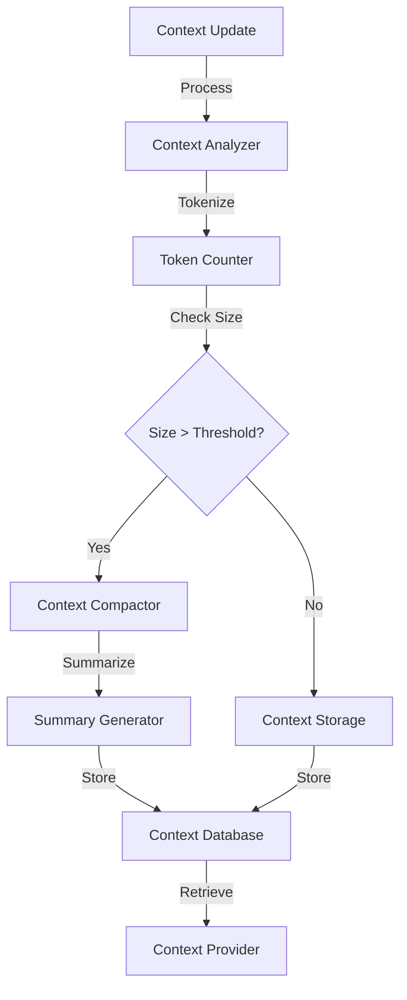

### 2. Tool Integration
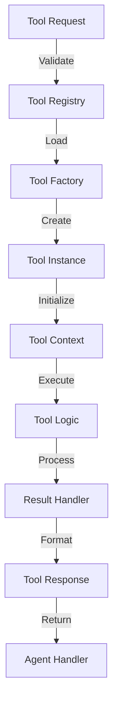

## System Requirements

### 1. Hardware Requirements
- CPU: 2+ cores
- RAM: 4GB minimum
- Storage: 10GB minimum
- Network: Stable internet connection

### 2. Software Requirements
- Python 3.8+
- Docker (optional)
- Git
- OpenAI API access

### 3. Dependencies
- FastAPI
- Pydantic
- SQLAlchemy
- OpenAI
- PyYAML
- Rich (for terminal UI)

## Deployment Architecture

### 1. Local Deployment
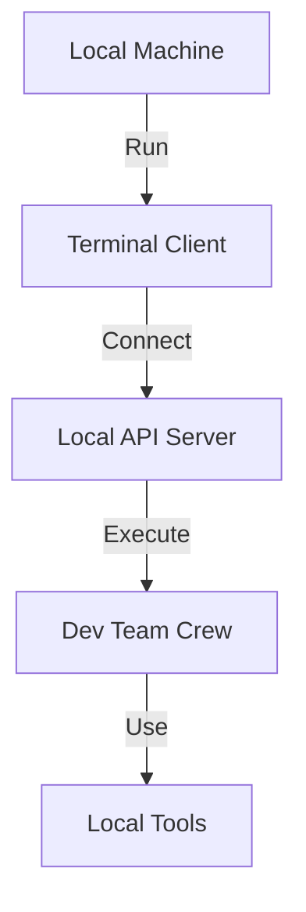

### 2. Docker Deployment
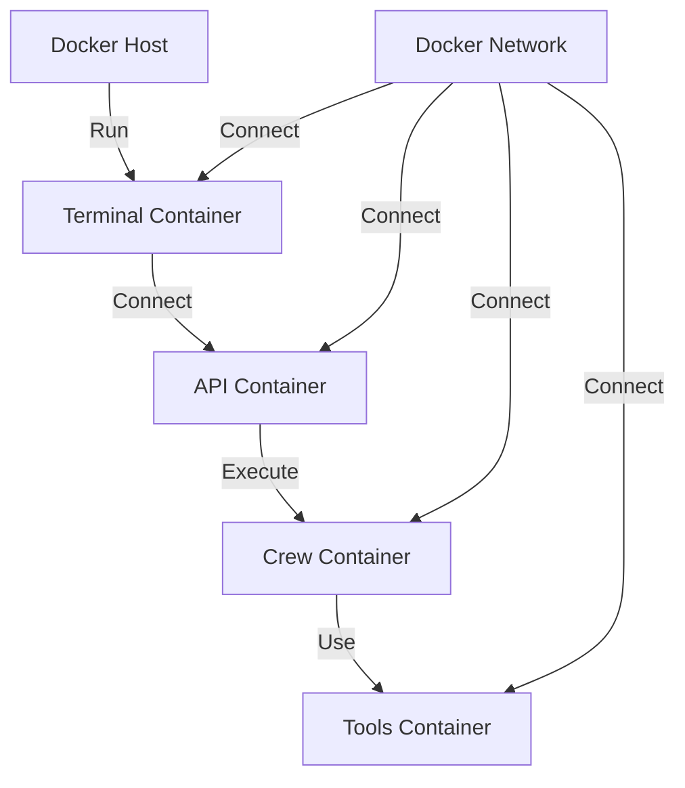

## Security Architecture

### 1. Authentication Flow
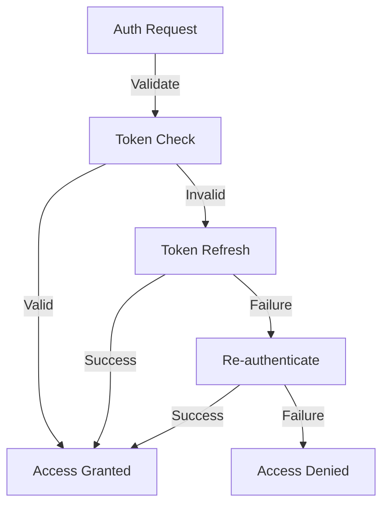

### 2. Authorization Flow
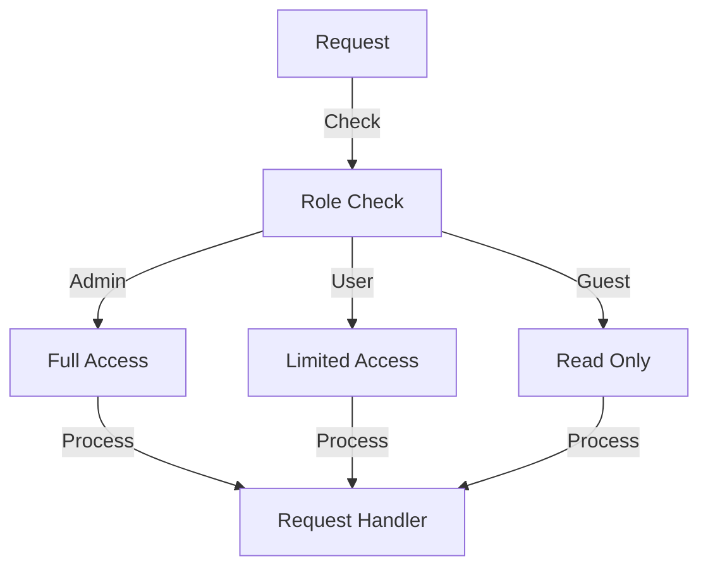

## Performance Architecture

### 1. Caching Strategy
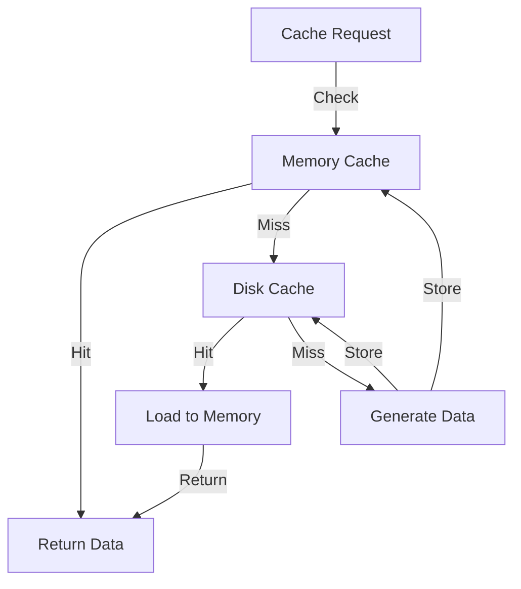

### 2. Resource Management
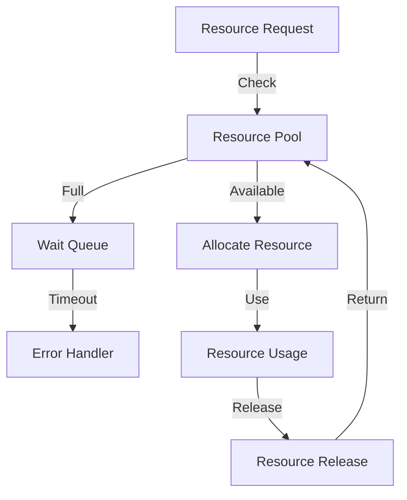

## Monitoring Architecture

### 1. Metrics Collection
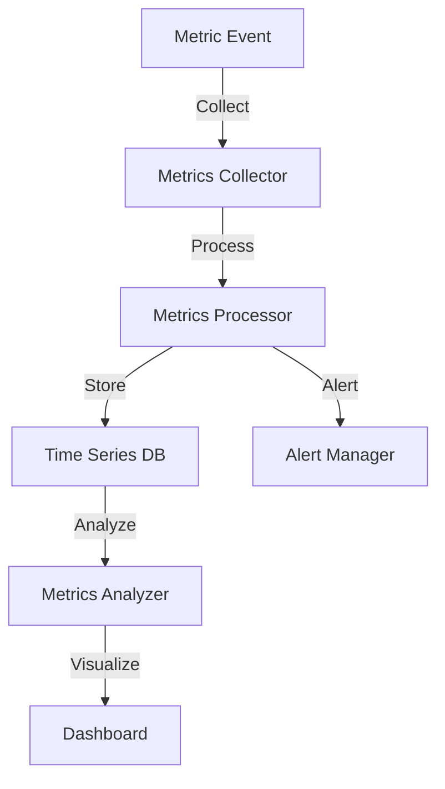

### 2. Health Monitoring
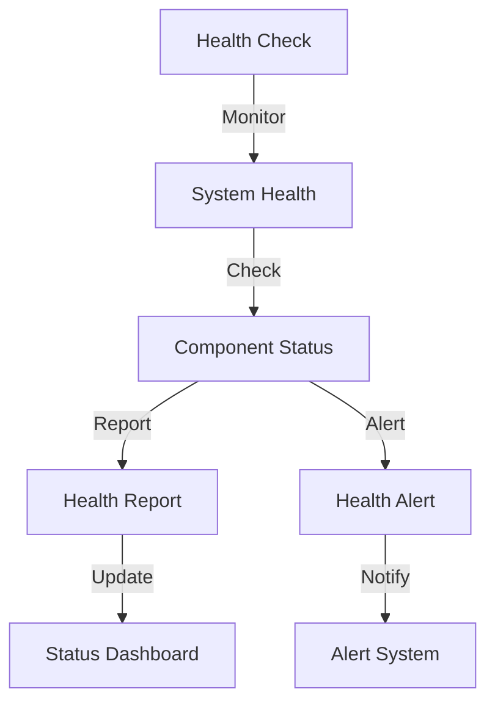

## Error Handling Architecture

### 1. Error Recovery
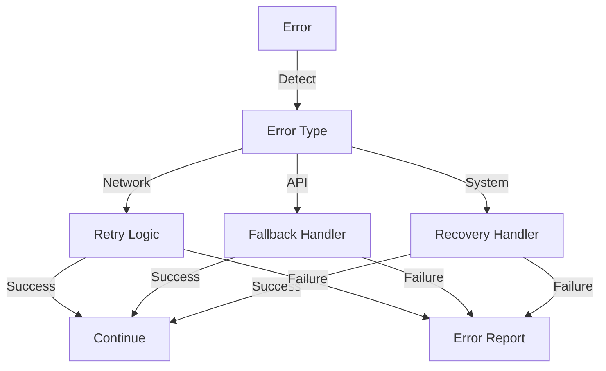

### 2. Logging System
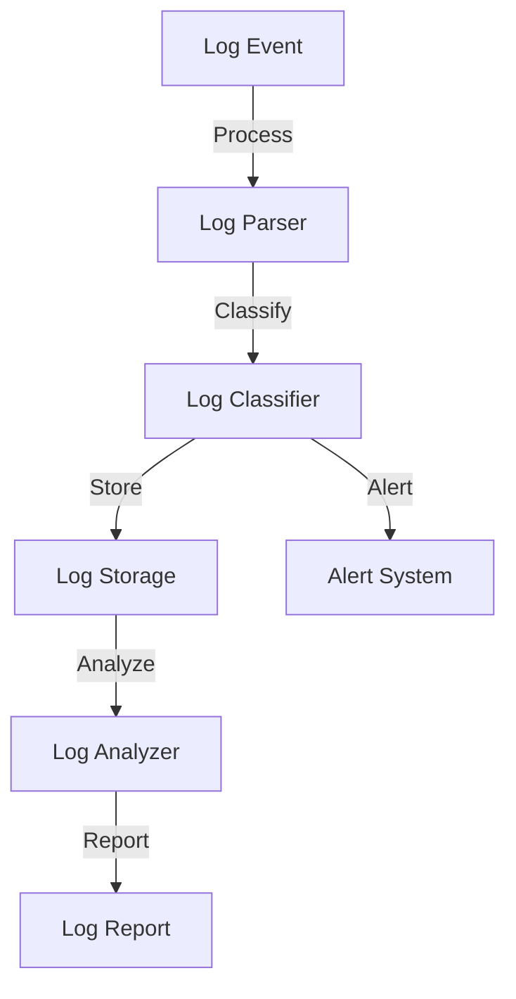