# DiscoMachina Flow Documentation

This document provides detailed flow charts for all use cases and scenarios in DiscoMachina.

## Key Enhancements

The following key enhancements have been implemented to improve the system's reliability, performance, and user experience:

### 1. WebSocket-Based Real-time Updates

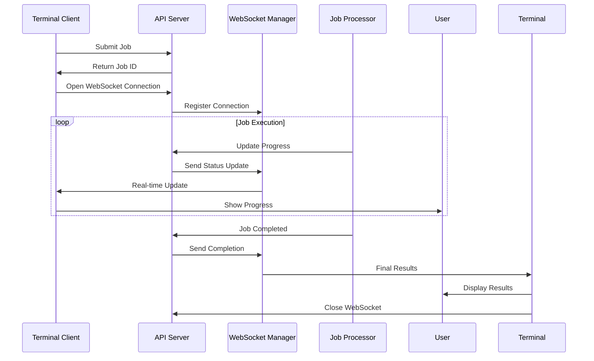
```mermaid
sequenceDiagram
    participant Client as Terminal Client
    participant Server as API Server
    participant WS as WebSocket Manager
    participant Job as Job Processor
    
    Client->>Server: Submit Job
    Server->>Client: Return Job ID
    Client->>Server: Open WebSocket Connection
    Server->>WS: Register Connection
    
    loop Job Execution
        Job->>Server: Update Progress
        Server->>WS: Send Status Update
        WS->>Client: Real-time Update
        Client->>User: Show Progress
    end
    
    Job->>Server: Job Completed
    Server->>WS: Send Completion
    WS->>Terminal: Final Results
    Terminal->>User: Display Results
    Terminal->>Server: Close WebSocket
```

### 2. Enhanced Error Recovery with Exponential Backoff

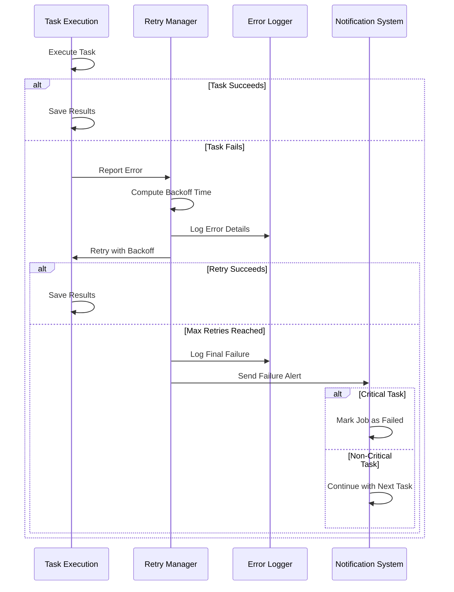
```mermaid
sequenceDiagram
    participant Task as Task Execution
    participant Retry as Retry Manager
    participant Logger as Error Logger
    participant Notify as Notification System
    
    Task->>Task: Execute Task
    
    alt Task Succeeds
        Task->>Task: Save Results
    else Task Fails
        Task->>Retry: Report Error
        Retry->>Retry: Compute Backoff Time
        Retry->>Logger: Log Error Details
        Retry->>Task: Retry with Backoff
        
        alt Retry Succeeds
            Task->>Task: Save Results
        else Max Retries Reached
            Retry->>Logger: Log Final Failure
            Retry->>Notify: Send Failure Alert
            
            alt Critical Task
                Notify->>Notify: Mark Job as Failed
            else Non-Critical Task
                Notify->>Notify: Continue with Next Task
            end
        end
    end
```

### 3. Task Checkpointing System

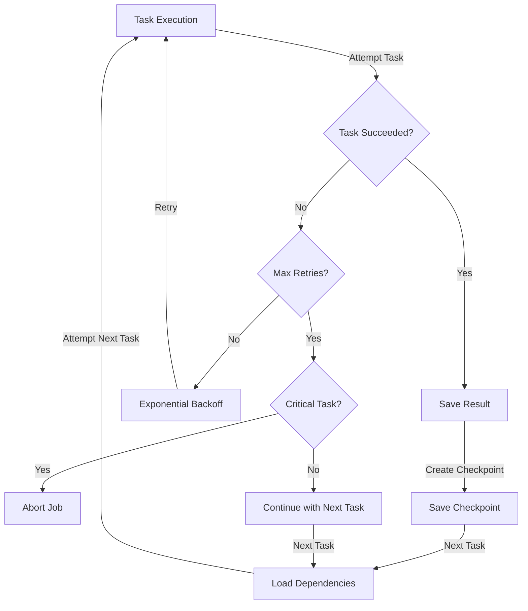
```mermaid
graph TD
    A[Task Execution] -->|Attempt Task| B{Task Succeeded?}
    B -->|Yes| C[Save Result]
    B -->|No| D{Max Retries?}
    D -->|No| E[Exponential Backoff]
    E -->|Retry| A
    D -->|Yes| F{Critical Task?}
    F -->|Yes| G[Abort Job]
    F -->|No| H[Continue with Next Task]
    C -->|Create Checkpoint| I[Save Checkpoint]
    I -->|Next Task| J[Load Dependencies]
    H -->|Next Task| J
    J -->|Attempt Next Task| A
```

### 4. Advanced Context Management

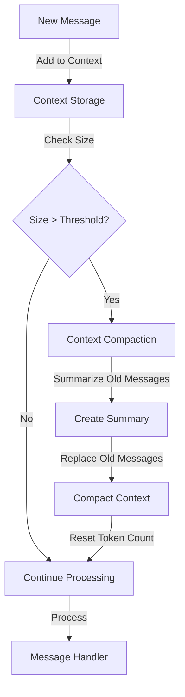
```mermaid
graph TD
    A[New Message] -->|Add to Context| B[Context Storage]
    B -->|Check Size| C{Size > Threshold?}
    C -->|Yes| D[Context Compaction]
    C -->|No| E[Continue Processing]
    D -->|Summarize Old Messages| F[Create Summary]
    F -->|Replace Old Messages| G[Compact Context]
    G -->|Reset Token Count| E
    E -->|Process| H[Message Handler]
```

## System Overview Flow

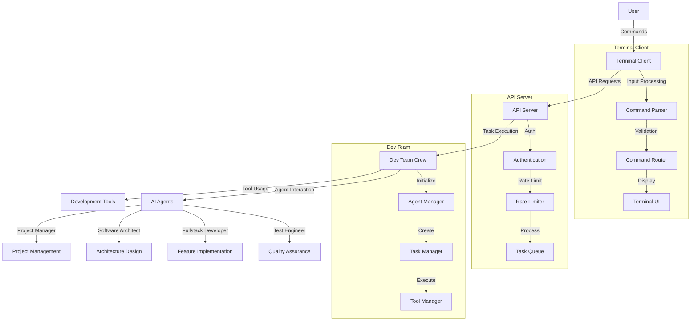
```mermaid
graph TD
    A[User] -->|Commands| B[Terminal Client]
    B -->|API Requests| C[API Server]
    C -->|Task Execution| D[Dev Team Crew]
    D -->|Tool Usage| E[Development Tools]
    D -->|Agent Interaction| F[AI Agents]
    F -->|Project Manager| G[Project Management]
    F -->|Software Architect| H[Architecture Design]
    F -->|Fullstack Developer| I[Feature Implementation]
    F -->|Test Engineer| J[Quality Assurance]
    
    subgraph Terminal Client
    B -->|Input Processing| B1[Command Parser]
    B1 -->|Validation| B2[Command Router]
    B2 -->|Display| B3[Terminal UI]
    end
    
    subgraph API Server
    C -->|Auth| C1[Authentication]
    C1 -->|Rate Limit| C2[Rate Limiter]
    C2 -->|Process| C3[Task Queue]
    end
    
    subgraph Dev Team
    D -->|Initialize| D1[Agent Manager]
    D1 -->|Create| D2[Task Manager]
    D2 -->|Execute| D3[Tool Manager]
    end
```

## Project Creation Flow

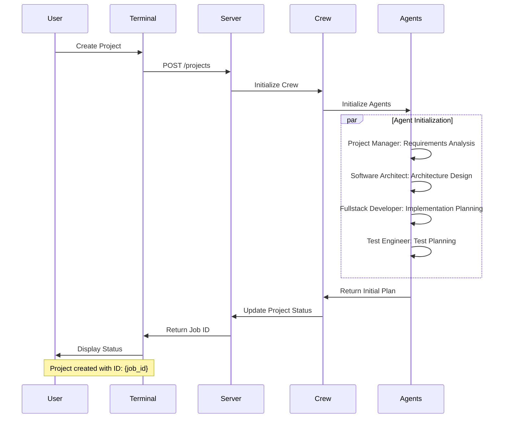
```mermaid
sequenceDiagram
    participant User
    participant Terminal
    participant Server
    participant Crew
    participant Agents
    
    User->>Terminal: Create Project
    Terminal->>Server: POST /projects
    Server->>Crew: Initialize Crew
    Crew->>Agents: Initialize Agents
    
    par Agent Initialization
        Agents->>Agents: Project Manager: Requirements Analysis
        Agents->>Agents: Software Architect: Architecture Design
        Agents->>Agents: Fullstack Developer: Implementation Planning
        Agents->>Agents: Test Engineer: Test Planning
    end
    
    Agents->>Crew: Return Initial Plan
    Crew->>Server: Update Project Status
    Server->>Terminal: Return Job ID
    Terminal->>User: Display Status
    
    Note over Terminal,User: Project created with ID: {job_id}
```

## Development Process Flow

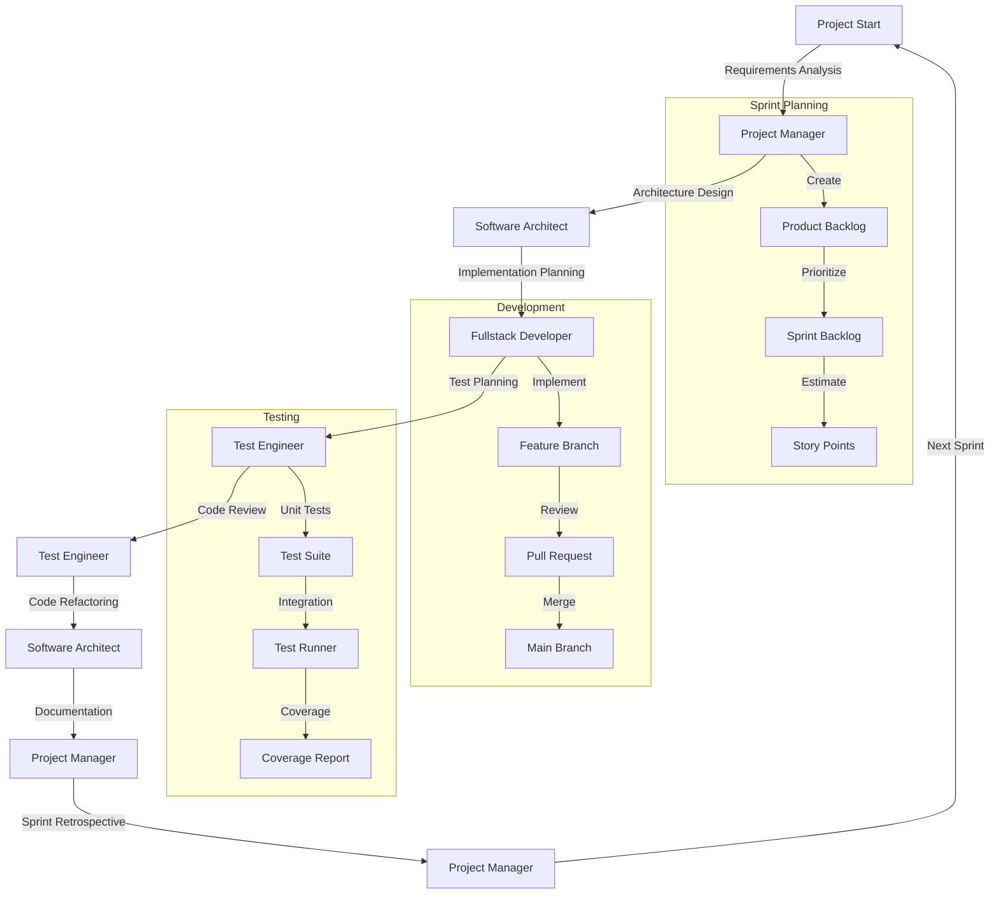
```mermaid
graph TD
    A[Project Start] -->|Requirements Analysis| B[Project Manager]
    B -->|Architecture Design| C[Software Architect]
    C -->|Implementation Planning| D[Fullstack Developer]
    D -->|Test Planning| E[Test Engineer]
    E -->|Code Review| F[Test Engineer]
    F -->|Code Refactoring| G[Software Architect]
    G -->|Documentation| H[Project Manager]
    H -->|Sprint Retrospective| I[Project Manager]
    I -->|Next Sprint| A
    
    subgraph Sprint Planning
    B -->|Create| B1[Product Backlog]
    B1 -->|Prioritize| B2[Sprint Backlog]
    B2 -->|Estimate| B3[Story Points]
    end
    
    subgraph Development
    D -->|Implement| D1[Feature Branch]
    D1 -->|Review| D2[Pull Request]
    D2 -->|Merge| D3[Main Branch]
    end
    
    subgraph Testing
    E -->|Unit Tests| E1[Test Suite]
    E1 -->|Integration| E2[Test Runner]
    E2 -->|Coverage| E3[Coverage Report]
    end
```

## Chat Interaction Flow

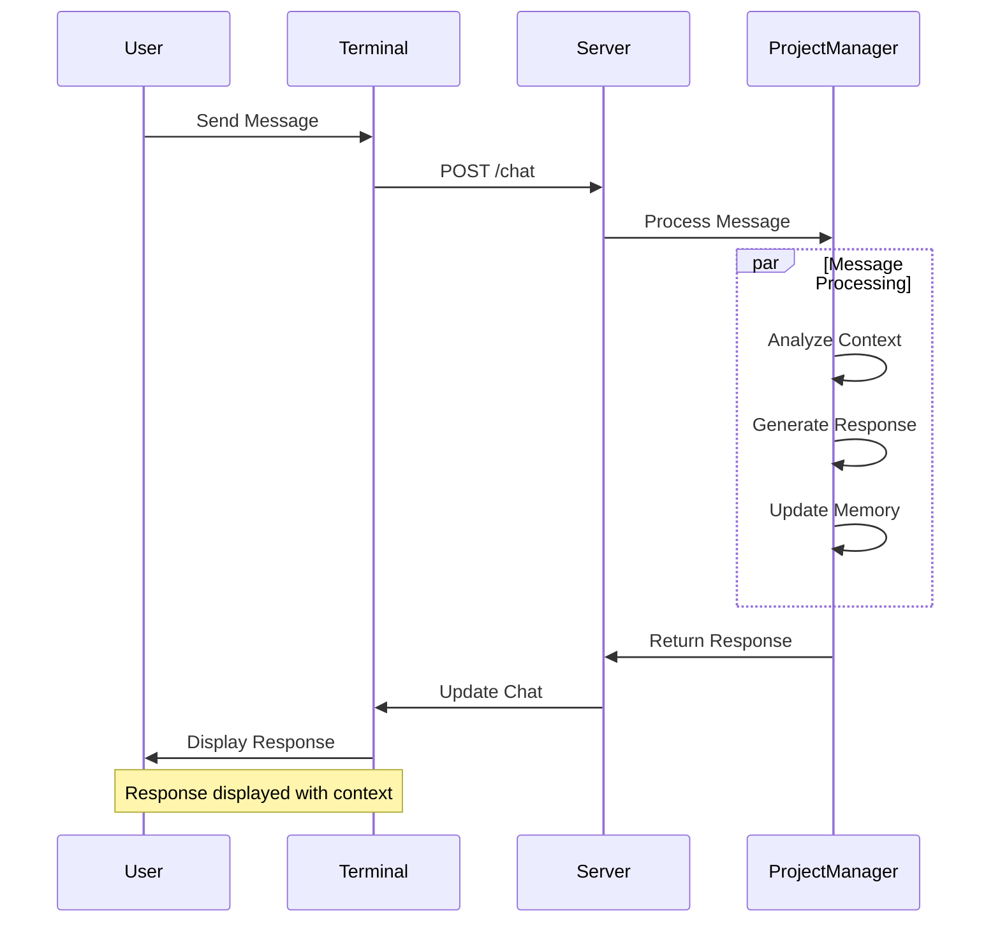
```mermaid
sequenceDiagram
    participant User
    participant Terminal
    participant Server
    participant ProjectManager
    
    User->>Terminal: Send Message
    Terminal->>Server: POST /chat
    Server->>ProjectManager: Process Message
    
    par Message Processing
        ProjectManager->>ProjectManager: Analyze Context
        ProjectManager->>ProjectManager: Generate Response
        ProjectManager->>ProjectManager: Update Memory
    end
    
    ProjectManager->>Server: Return Response
    Server->>Terminal: Update Chat
    Terminal->>User: Display Response
    
    Note over Terminal,User: Response displayed with context
```

## Task Execution Flow

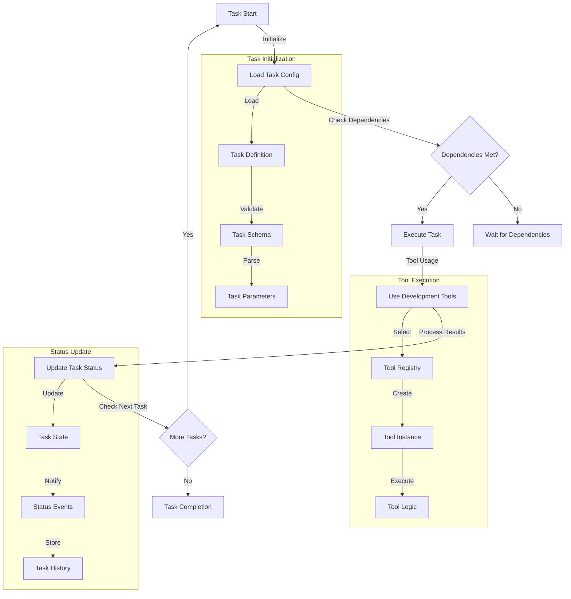
```mermaid
graph TD
    A[Task Start] -->|Initialize| B[Load Task Config]
    B -->|Check Dependencies| C{Dependencies Met?}
    C -->|No| D[Wait for Dependencies]
    C -->|Yes| E[Execute Task]
    E -->|Tool Usage| F[Use Development Tools]
    F -->|Process Results| G[Update Task Status]
    G -->|Check Next Task| H{More Tasks?}
    H -->|Yes| A
    H -->|No| I[Task Completion]
    
    subgraph Task Initialization
    B -->|Load| B1[Task Definition]
    B1 -->|Validate| B2[Task Schema]
    B2 -->|Parse| B3[Task Parameters]
    end
    
    subgraph Tool Execution
    F -->|Select| F1[Tool Registry]
    F1 -->|Create| F2[Tool Instance]
    F2 -->|Execute| F3[Tool Logic]
    end
    
    subgraph Status Update
    G -->|Update| G1[Task State]
    G1 -->|Notify| G2[Status Events]
    G2 -->|Store| G3[Task History]
    end
```

## Error Handling Flow

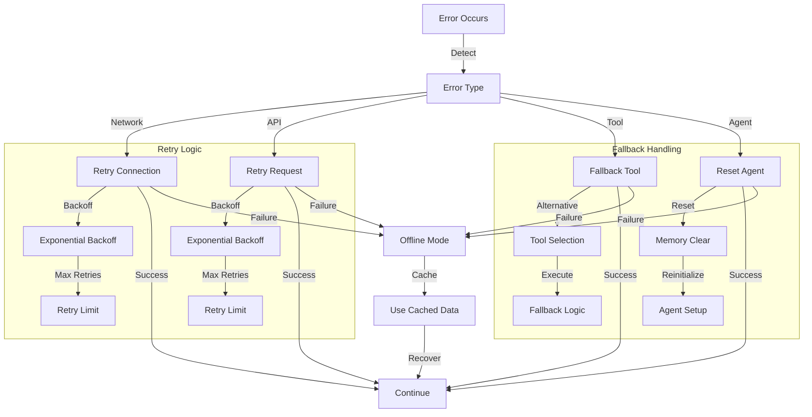
```mermaid
graph TD
    A[Error Occurs] -->|Detect| B[Error Type]
    B -->|Network| C[Retry Connection]
    B -->|API| D[Retry Request]
    B -->|Tool| E[Fallback Tool]
    B -->|Agent| F[Reset Agent]
    
    subgraph Retry Logic
    C -->|Backoff| C1[Exponential Backoff]
    C1 -->|Max Retries| C2[Retry Limit]
    D -->|Backoff| D1[Exponential Backoff]
    D1 -->|Max Retries| D2[Retry Limit]
    end
    
    subgraph Fallback Handling
    E -->|Alternative| E1[Tool Selection]
    E1 -->|Execute| E2[Fallback Logic]
    F -->|Reset| F1[Memory Clear]
    F1 -->|Reinitialize| F2[Agent Setup]
    end
    
    C -->|Success| G[Continue]
    D -->|Success| G
    E -->|Success| G
    F -->|Success| G
    
    C -->|Failure| H[Offline Mode]
    D -->|Failure| H
    E -->|Failure| H
    F -->|Failure| H
    
    H -->|Cache| I[Use Cached Data]
    I -->|Recover| G
```

## Context Management Flow

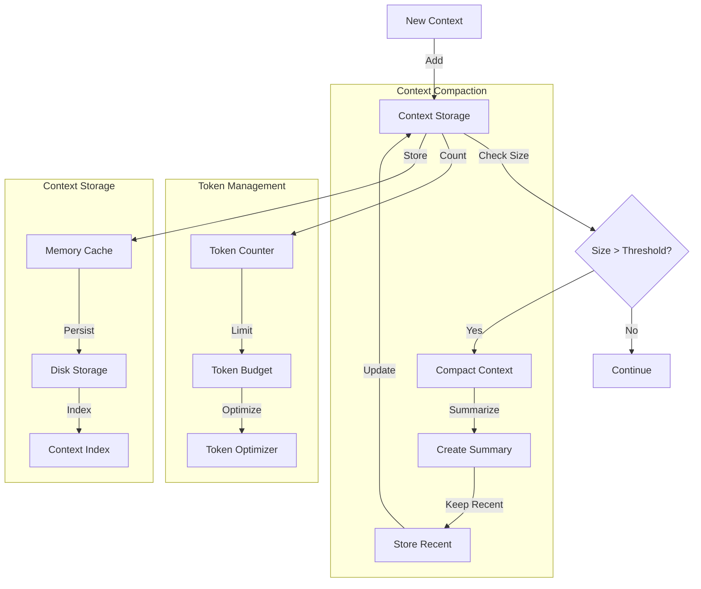
```mermaid
graph TD
    A[New Context] -->|Add| B[Context Storage]
    B -->|Check Size| C{Size > Threshold?}
    C -->|Yes| D[Compact Context]
    C -->|No| E[Continue]
    
    subgraph Context Compaction
    D -->|Summarize| F[Create Summary]
    F -->|Keep Recent| G[Store Recent]
    G -->|Update| B
    end
    
    subgraph Token Management
    B -->|Count| B1[Token Counter]
    B1 -->|Limit| B2[Token Budget]
    B2 -->|Optimize| B3[Token Optimizer]
    end
    
    subgraph Context Storage
    B -->|Store| B4[Memory Cache]
    B4 -->|Persist| B5[Disk Storage]
    B5 -->|Index| B6[Context Index]
    end
```

## Development Tools Flow

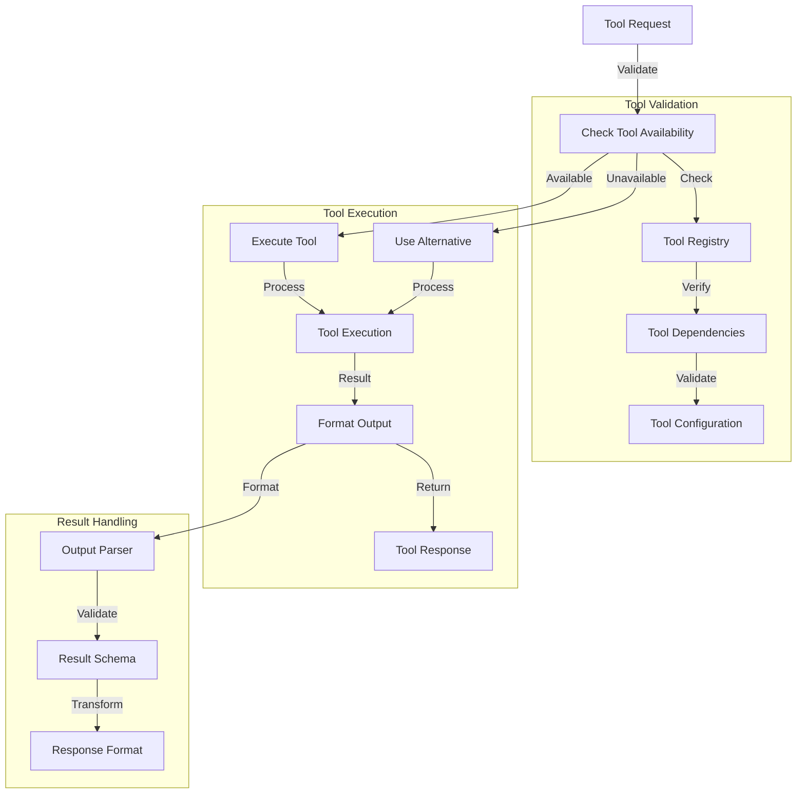
```mermaid
graph TD
    A[Tool Request] -->|Validate| B[Check Tool Availability]
    B -->|Available| C[Execute Tool]
    B -->|Unavailable| D[Use Alternative]
    
    subgraph Tool Validation
    B -->|Check| B1[Tool Registry]
    B1 -->|Verify| B2[Tool Dependencies]
    B2 -->|Validate| B3[Tool Configuration]
    end
    
    subgraph Tool Execution
    C -->|Process| E[Tool Execution]
    D -->|Process| E
    E -->|Result| F[Format Output]
    F -->|Return| G[Tool Response]
    end
    
    subgraph Result Handling
    F -->|Format| F1[Output Parser]
    F1 -->|Validate| F2[Result Schema]
    F2 -->|Transform| F3[Response Format]
    end
```

## Agent Interaction Flow

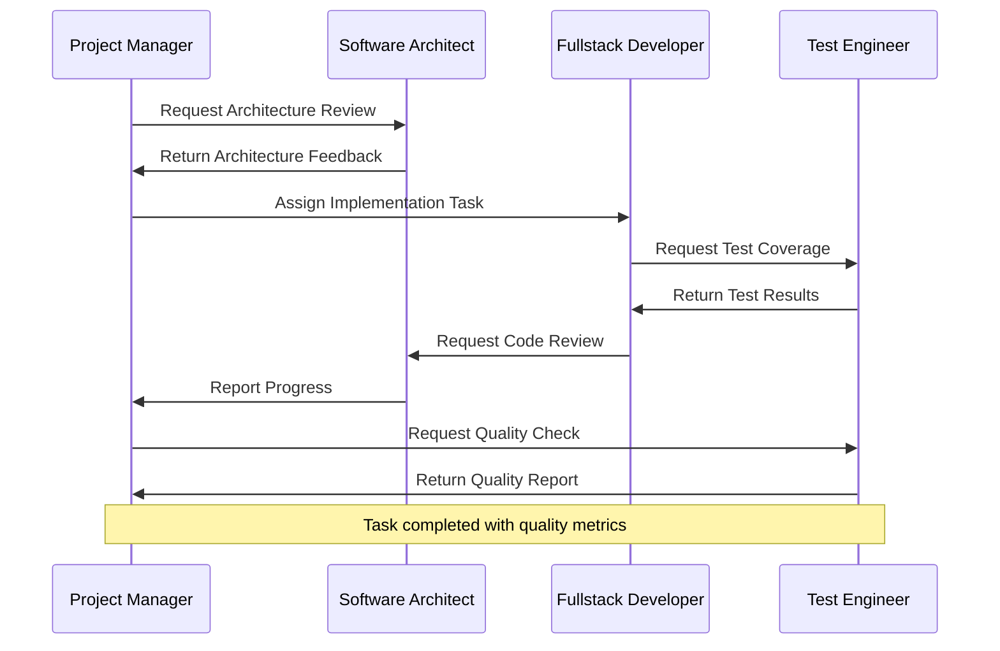
```mermaid
sequenceDiagram
    participant PM as Project Manager
    participant SA as Software Architect
    participant FD as Fullstack Developer
    participant TE as Test Engineer
    
    PM->>SA: Request Architecture Review
    SA->>PM: Return Architecture Feedback
    PM->>FD: Assign Implementation Task
    FD->>TE: Request Test Coverage
    TE->>FD: Return Test Results
    FD->>SA: Request Code Review
    SA->>PM: Report Progress
    PM->>TE: Request Quality Check
    TE->>PM: Return Quality Report
    
    Note over PM,TE: Task completed with quality metrics
```

## API Server Flow

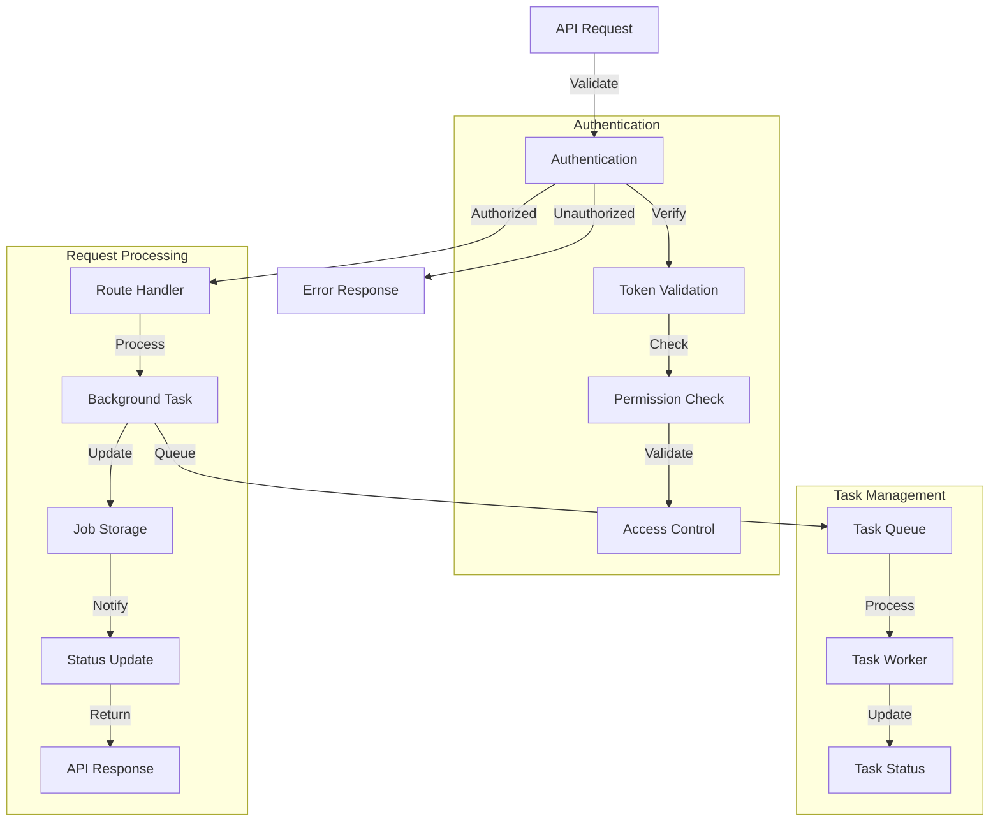
```mermaid
graph TD
    A[API Request] -->|Validate| B[Authentication]
    B -->|Authorized| C[Route Handler]
    B -->|Unauthorized| D[Error Response]
    
    subgraph Request Processing
    C -->|Process| E[Background Task]
    E -->|Update| F[Job Storage]
    F -->|Notify| G[Status Update]
    G -->|Return| H[API Response]
    end
    
    subgraph Authentication
    B -->|Verify| B1[Token Validation]
    B1 -->|Check| B2[Permission Check]
    B2 -->|Validate| B3[Access Control]
    end
    
    subgraph Task Management
    E -->|Queue| E1[Task Queue]
    E1 -->|Process| E2[Task Worker]
    E2 -->|Update| E3[Task Status]
    end
```

## Docker Deployment Flow

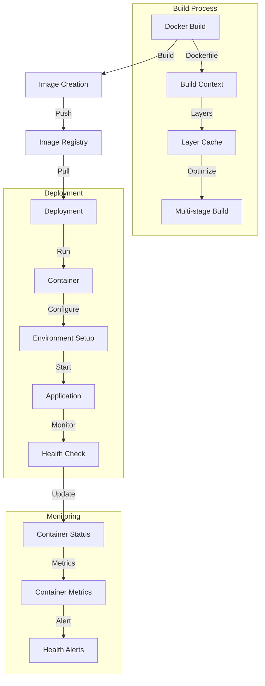
```mermaid
graph TD
    A[Docker Build] -->|Build| B[Image Creation]
    B -->|Push| C[Image Registry]
    C -->|Pull| D[Deployment]
    
    subgraph Build Process
    A -->|Dockerfile| A1[Build Context]
    A1 -->|Layers| A2[Layer Cache]
    A2 -->|Optimize| A3[Multi-stage Build]
    end
    
    subgraph Deployment
    D -->|Run| E[Container]
    E -->|Configure| F[Environment Setup]
    F -->|Start| G[Application]
    G -->|Monitor| H[Health Check]
    end
    
    subgraph Monitoring
    H -->|Update| I[Container Status]
    I -->|Metrics| I1[Container Metrics]
    I1 -->|Alert| I2[Health Alerts]
    end
```

## Testing Flow

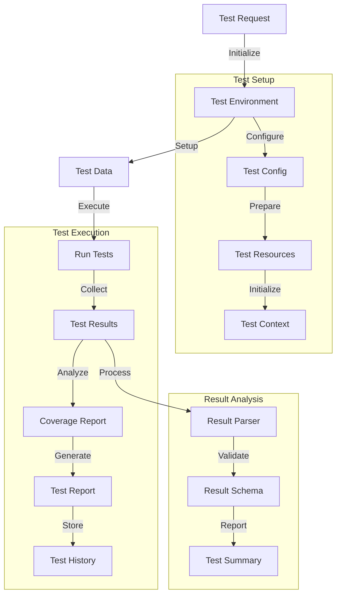
```mermaid
graph TD
    A[Test Request] -->|Initialize| B[Test Environment]
    B -->|Setup| C[Test Data]
    C -->|Execute| D[Run Tests]
    
    subgraph Test Setup
    B -->|Configure| B1[Test Config]
    B1 -->|Prepare| B2[Test Resources]
    B2 -->|Initialize| B3[Test Context]
    end
    
    subgraph Test Execution
    D -->|Collect| E[Test Results]
    E -->|Analyze| F[Coverage Report]
    F -->|Generate| G[Test Report]
    G -->|Store| H[Test History]
    end
    
    subgraph Result Analysis
    E -->|Process| E1[Result Parser]
    E1 -->|Validate| E2[Result Schema]
    E2 -->|Report| E3[Test Summary]
    end
```

## Documentation Flow

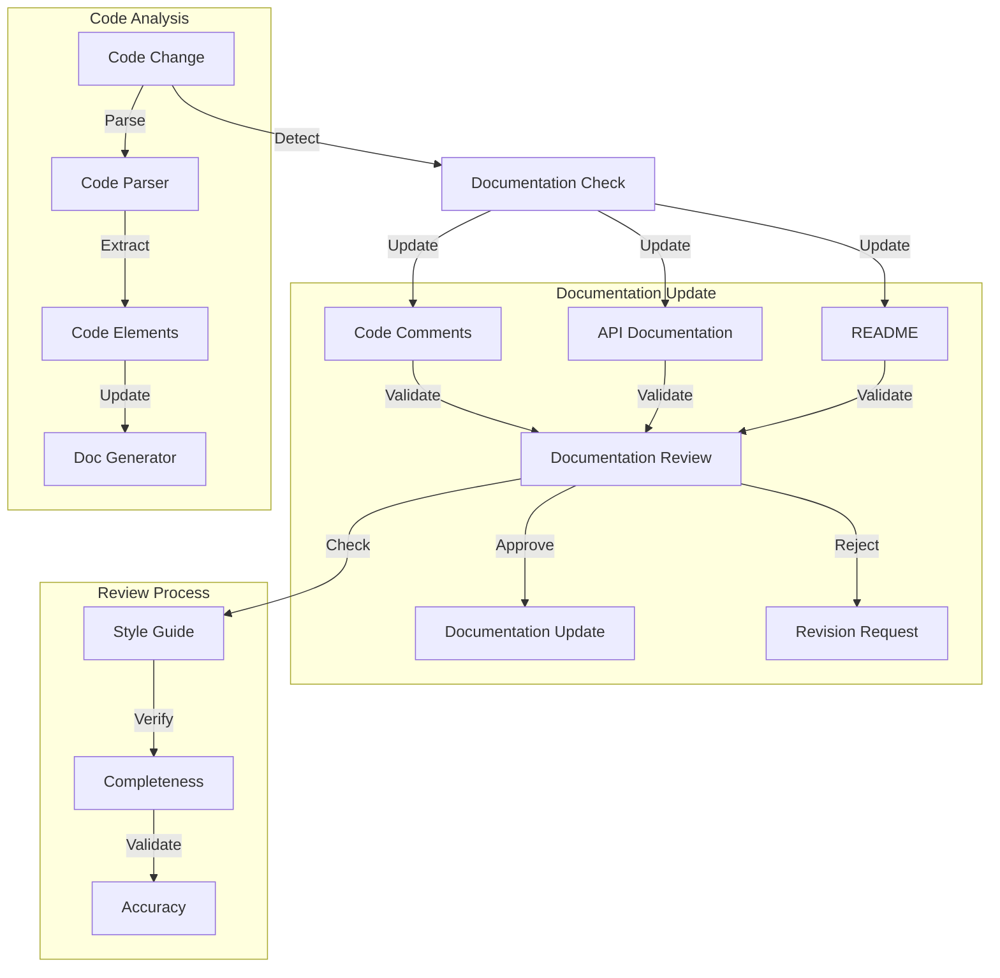
```mermaid
graph TD
    A[Code Change] -->|Detect| B[Documentation Check]
    B -->|Update| C[Code Comments]
    B -->|Update| D[API Documentation]
    B -->|Update| E[README]
    
    subgraph Documentation Update
    C -->|Validate| F[Documentation Review]
    D -->|Validate| F
    E -->|Validate| F
    F -->|Approve| G[Documentation Update]
    F -->|Reject| H[Revision Request]
    end
    
    subgraph Code Analysis
    A -->|Parse| A1[Code Parser]
    A1 -->|Extract| A2[Code Elements]
    A2 -->|Update| A3[Doc Generator]
    end
    
    subgraph Review Process
    F -->|Check| F1[Style Guide]
    F1 -->|Verify| F2[Completeness]
    F2 -->|Validate| F3[Accuracy]
    end
```

## Memory Management Flow

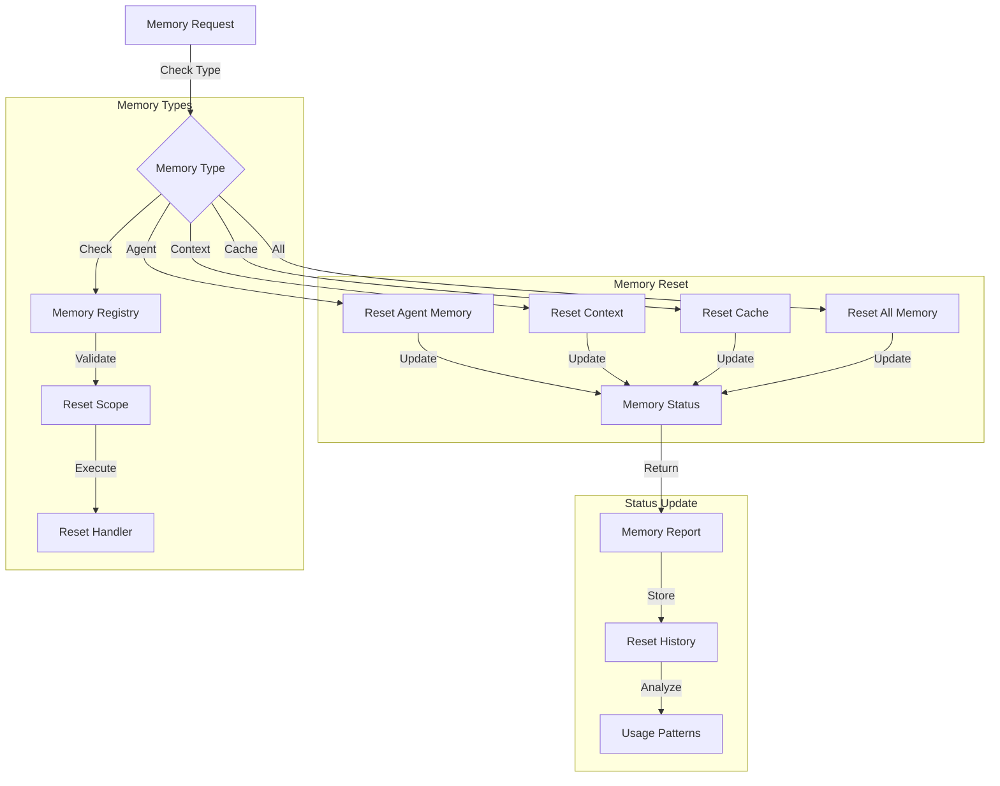
```mermaid
graph TD
    A[Memory Request] -->|Check Type| B{Memory Type}
    B -->|Agent| C[Reset Agent Memory]
    B -->|Context| D[Reset Context]
    B -->|Cache| E[Reset Cache]
    B -->|All| F[Reset All Memory]
    
    subgraph Memory Reset
    C -->|Update| G[Memory Status]
    D -->|Update| G
    E -->|Update| G
    F -->|Update| G
    end
    
    subgraph Status Update
    G -->|Return| H[Memory Report]
    H -->|Store| H1[Reset History]
    H1 -->|Analyze| H2[Usage Patterns]
    end
    
    subgraph Memory Types
    B -->|Check| B1[Memory Registry]
    B1 -->|Validate| B2[Reset Scope]
    B2 -->|Execute| B3[Reset Handler]
    end
```

## Workspace Analysis Flow

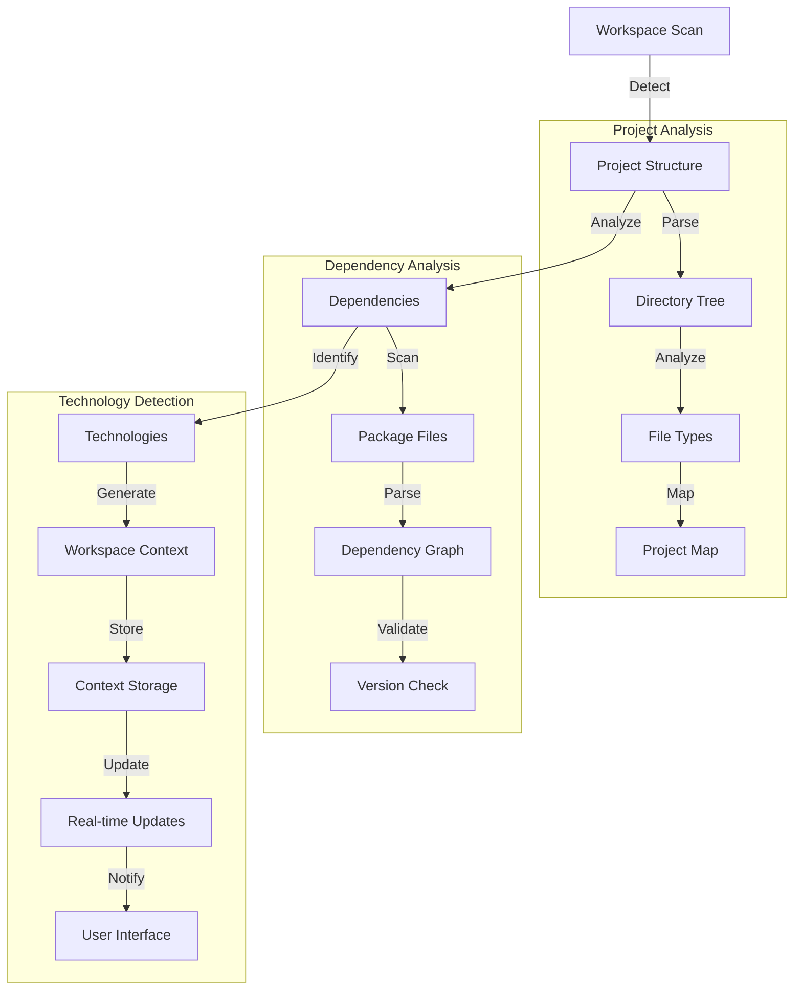
```mermaid
graph TD
    A[Workspace Scan] -->|Detect| B[Project Structure]
    B -->|Analyze| C[Dependencies]
    C -->|Identify| D[Technologies]
    
    subgraph Project Analysis
    B -->|Parse| B1[Directory Tree]
    B1 -->|Analyze| B2[File Types]
    B2 -->|Map| B3[Project Map]
    end
    
    subgraph Dependency Analysis
    C -->|Scan| C1[Package Files]
    C1 -->|Parse| C2[Dependency Graph]
    C2 -->|Validate| C3[Version Check]
    end
    
    subgraph Technology Detection
    D -->|Generate| E[Workspace Context]
    E -->|Store| F[Context Storage]
    F -->|Update| G[Real-time Updates]
    G -->|Notify| H[User Interface]
    end
```

## Sprint Management Flow

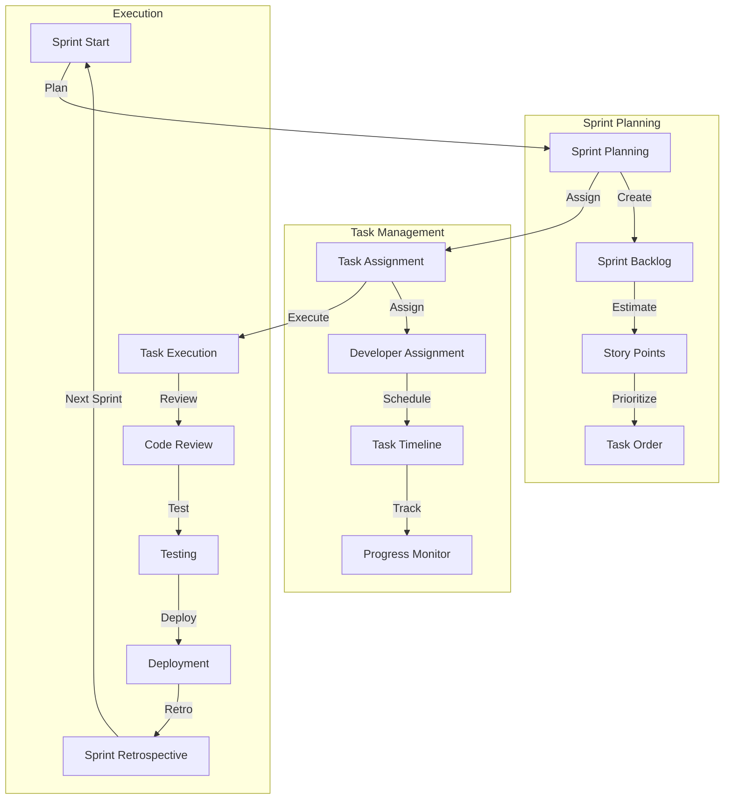
```mermaid
graph TD
    A[Sprint Start] -->|Plan| B[Sprint Planning]
    B -->|Assign| C[Task Assignment]
    C -->|Execute| D[Task Execution]
    
    subgraph Sprint Planning
    B -->|Create| B1[Sprint Backlog]
    B1 -->|Estimate| B2[Story Points]
    B2 -->|Prioritize| B3[Task Order]
    end
    
    subgraph Task Management
    C -->|Assign| C1[Developer Assignment]
    C1 -->|Schedule| C2[Task Timeline]
    C2 -->|Track| C3[Progress Monitor]
    end
    
    subgraph Execution
    D -->|Review| E[Code Review]
    E -->|Test| F[Testing]
    F -->|Deploy| G[Deployment]
    G -->|Retro| H[Sprint Retrospective]
    H -->|Next Sprint| A
    end
```

## Code Review Flow

```mermaid
sequenceDiagram
    participant Dev as Developer
    participant TE as Test Engineer
    participant SA as Software Architect
    
    Dev->>TE: Submit Code Review
    TE->>Dev: Initial Review
    Dev->>SA: Architecture Review
    SA->>Dev: Architecture Feedback
    TE->>Dev: Final Review
    Dev->>Dev: Address Comments
    Dev->>TE: Resubmit Review
    TE->>Dev: Approve Changes
    
    Note over Dev,TE: Code review completed with feedback
```

## Feature Implementation Flow

```mermaid
graph TD
    A[Feature Request] -->|Analyze| B[Requirements]
    B -->|Design| C[Architecture]
    C -->|Implement| D[Code]
    
    subgraph Requirements Analysis
    B -->|Extract| B1[User Stories]
    B1 -->|Validate| B2[Acceptance Criteria]
    B2 -->|Plan| B3[Implementation Plan]
    end
    
    subgraph Architecture Design
    C -->|Create| C1[System Design]
    C1 -->|Review| C2[Design Review]
    C2 -->|Approve| C3[Final Design]
    end
    
    subgraph Implementation
    D -->|Test| E[Unit Tests]
    E -->|Review| F[Code Review]
    F -->|Deploy| G[Integration]
    G -->|Verify| H[Feature Testing]
    H -->|Release| I[Production]
    end
```

## Bug Fixing Flow

```mermaid
graph TD
    A[Bug Report] -->|Analyze| B[Root Cause]
    B -->|Plan| C[Fix Strategy]
    C -->|Implement| D[Code Fix]
    
    subgraph Bug Analysis
    A -->|Investigate| A1[Bug Investigation]
    A1 -->|Reproduce| A2[Bug Reproduction]
    A2 -->|Document| A3[Bug Details]
    end
    
    subgraph Fix Planning
    C -->|Design| C1[Fix Design]
    C1 -->|Review| C2[Fix Review]
    C2 -->|Approve| C3[Fix Plan]
    end
    
    subgraph Implementation
    D -->|Test| E[Regression Tests]
    E -->|Review| F[Code Review]
    F -->|Deploy| G[Hotfix]
    G -->|Verify| H[Bug Resolution]
    H -->|Document| I[Fix Documentation]
    end
```

## Performance Optimization Flow

```mermaid
graph TD
    A[Performance Issue] -->|Profile| B[Performance Data]
    B -->|Analyze| C[Bottlenecks]
    C -->|Optimize| D[Code Changes]
    
    subgraph Performance Analysis
    B -->|Collect| B1[Metrics Collection]
    B1 -->|Process| B2[Data Analysis]
    B2 -->|Identify| B3[Performance Issues]
    end
    
    subgraph Optimization
    C -->|Plan| C1[Optimization Plan]
    C1 -->|Implement| C2[Code Changes]
    C2 -->|Test| C3[Performance Tests]
    end
    
    subgraph Verification
    D -->|Test| E[Performance Tests]
    E -->|Measure| F[Improvements]
    F -->|Document| G[Optimization Report]
    G -->|Monitor| H[Performance Tracking]
    end
```

## Security Review Flow

```mermaid
graph TD
    A[Security Scan] -->|Analyze| B[Vulnerabilities]
    B -->|Assess| C[Risk Level]
    C -->|Plan| D[Security Fixes]
    
    subgraph Security Analysis
    B -->|Scan| B1[Code Scanner]
    B1 -->|Analyze| B2[Vulnerability Analysis]
    B2 -->|Report| B3[Security Report]
    end
    
    subgraph Risk Assessment
    C -->|Evaluate| C1[Risk Evaluation]
    C1 -->|Prioritize| C2[Risk Priority]
    C2 -->|Plan| C3[Mitigation Plan]
    end
    
    subgraph Security Implementation
    D -->|Implement| E[Security Patches]
    E -->|Test| F[Security Tests]
    F -->|Review| G[Security Review]
    G -->|Deploy| H[Security Updates]
    H -->|Monitor| I[Security Monitoring]
    end
```

## Dependency Management Flow

```mermaid
graph TD
    A[Dependency Check] -->|Scan| B[Dependencies]
    B -->|Analyze| C[Versions]
    C -->|Update| D[Update Plan]
    
    subgraph Dependency Analysis
    B -->|Detect| B1[Package Scanner]
    B1 -->|Parse| B2[Dependency Tree]
    B2 -->|Validate| B3[Dependency Check]
    end
    
    subgraph Version Management
    C -->|Check| C1[Version Checker]
    C1 -->|Compare| C2[Version Comparison]
    C2 -->|Plan| C3[Update Strategy]
    end
    
    subgraph Update Process
    D -->|Test| E[Compatibility]
    E -->|Deploy| F[Updates]
    F -->|Verify| G[Functionality]
    G -->|Document| H[Dependency Report]
    end
```

## Documentation Generation Flow

```mermaid
graph TD
    A[Code Analysis] -->|Extract| B[Code Structure]
    B -->|Generate| C[API Docs]
    B -->|Generate| D[Code Docs]
    
    subgraph Code Analysis
    A -->|Parse| A1[Code Parser]
    A1 -->|Extract| A2[Code Elements]
    A2 -->|Organize| A3[Code Structure]
    end
    
    subgraph Documentation Generation
    C -->|Format| E[Documentation]
    D -->|Format| E
    E -->|Review| F[Doc Review]
    F -->|Publish| G[Final Docs]
    G -->|Update| H[Version Control]
    end
    
    subgraph Review Process
    F -->|Check| F1[Style Guide]
    F1 -->|Verify| F2[Completeness]
    F2 -->|Validate| F3[Accuracy]
    end
```

## Training Mode Flow

```mermaid
graph TD
    A[Training Start] -->|Initialize| B[Training Data]
    B -->|Process| C[Model Training]
    C -->|Validate| D[Performance Check]
    
    subgraph Data Preparation
    B -->|Load| B1[Data Loader]
    B1 -->|Preprocess| B2[Data Preprocessor]
    B2 -->|Validate| B3[Data Validator]
    end
    
    subgraph Training Process
    C -->|Train| C1[Model Trainer]
    C1 -->|Optimize| C2[Model Optimizer]
    C2 -->|Save| C3[Model Saver]
    end
    
    subgraph Validation
    D -->|Optimize| E[Model Optimization]
    E -->|Test| F[Training Tests]
    F -->|Save| G[Model Save]
    G -->|Deploy| H[Model Deployment]
    end
```

## Testing Mode Flow

```mermaid
graph TD
    A[Test Start] -->|Setup| B[Test Environment]
    B -->|Configure| C[Test Cases]
    C -->|Execute| D[Test Run]
    
    subgraph Environment Setup
    B -->|Initialize| B1[Test Config]
    B1 -->|Prepare| B2[Test Resources]
    B2 -->|Validate| B3[Environment Check]
    end
    
    subgraph Test Execution
    D -->|Collect| E[Test Results]
    E -->|Analyze| F[Performance Metrics]
    F -->|Report| G[Test Report]
    G -->|Archive| H[Test History]
    end
    
    subgraph Result Analysis
    E -->|Process| E1[Result Parser]
    E1 -->|Validate| E2[Result Schema]
    E2 -->|Report| E3[Test Summary]
    end
```

## Replay Mode Flow

```mermaid
graph TD
    A[Replay Request] -->|Load| B[Task History]
    B -->|Reconstruct| C[Task Context]
    C -->|Execute| D[Task Replay]
    
    subgraph History Loading
    B -->|Load| B1[History Loader]
    B1 -->|Parse| B2[History Parser]
    B2 -->|Validate| B3[History Validator]
    end
    
    subgraph Context Reconstruction
    C -->|Build| C1[Context Builder]
    C1 -->|Validate| C2[Context Validator]
    C2 -->|Prepare| C3[Context Setup]
    end
    
    subgraph Replay Execution
    D -->|Compare| E[Results Comparison]
    E -->|Analyze| F[Replay Analysis]
    F -->|Report| G[Replay Report]
    G -->|Store| H[Replay History]
    end
```

## Reset Mode Flow

```mermaid
graph TD
    A[Reset Request] -->|Identify| B[Reset Scope]
    B -->|Agent| C[Reset Agent Memory]
    B -->|Context| D[Reset Context]
    B -->|Cache| E[Reset Cache]
    
    subgraph Reset Planning
    B -->|Analyze| B1[Scope Analyzer]
    B1 -->|Plan| B2[Reset Plan]
    B2 -->|Validate| B3[Reset Validator]
    end
    
    subgraph Reset Execution
    C -->|Verify| F[Reset Verification]
    D -->|Verify| F
    E -->|Verify| F
    end
    
    subgraph Status Update
    F -->|Report| G[Reset Report]
    G -->|Update| H[System State]
    H -->|Notify| I[Status Notification]
    end
``` 