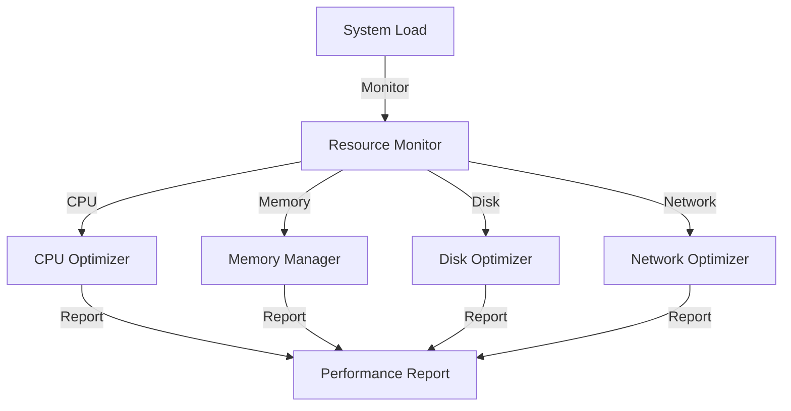
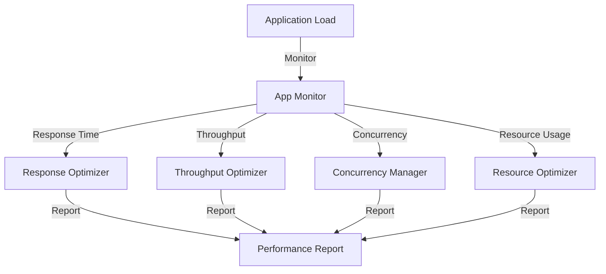
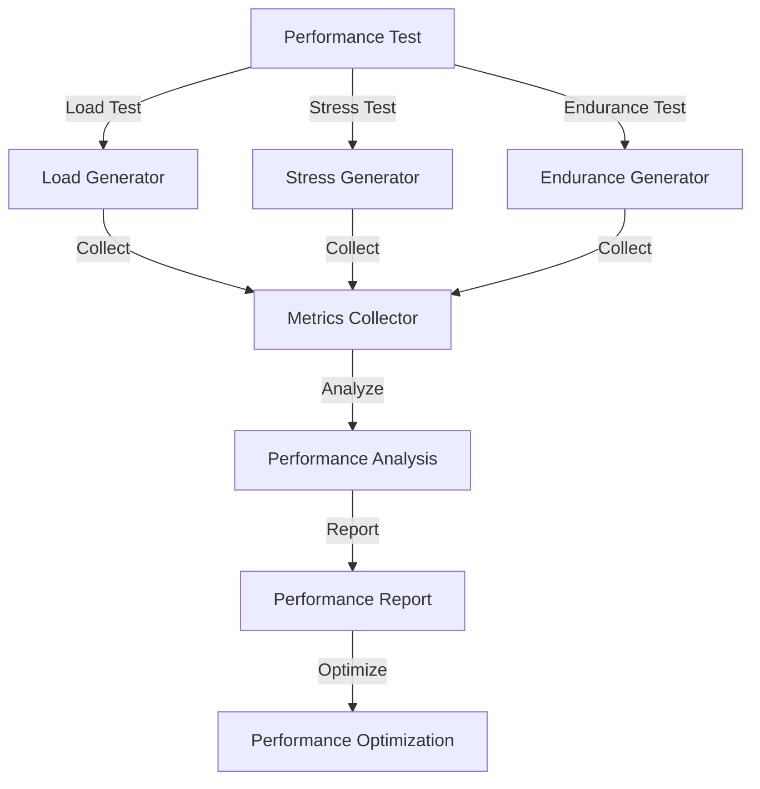
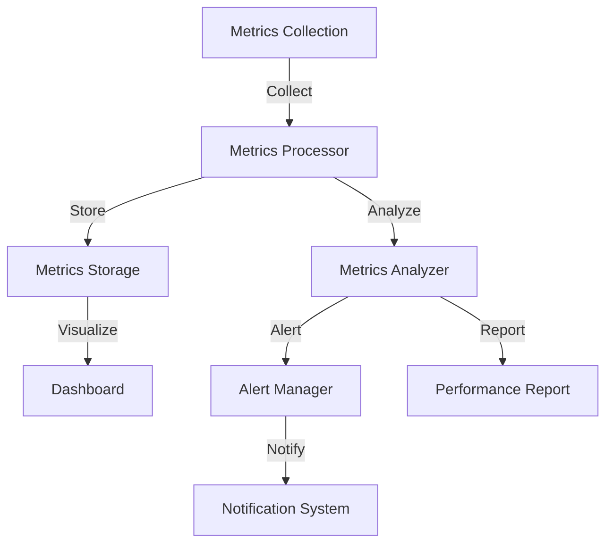
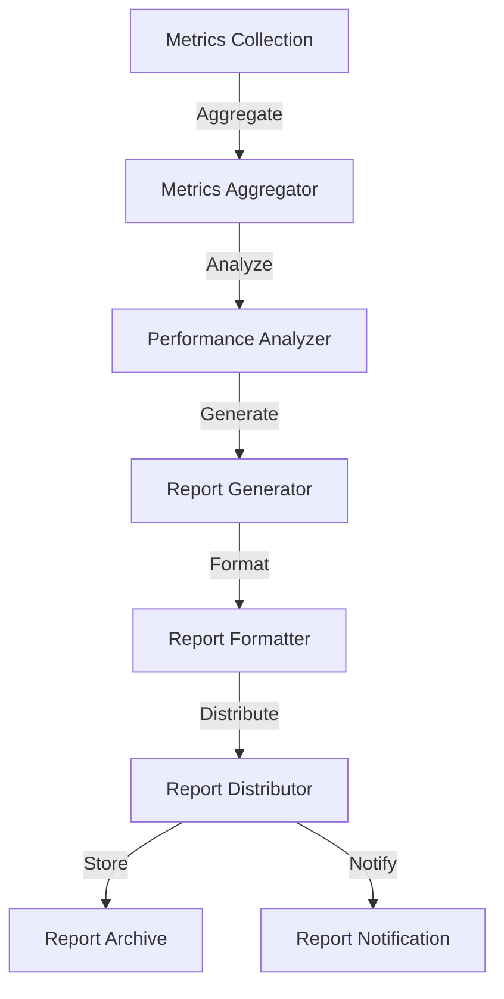

# DiscoMachina Performance Documentation

## Overview

This document outlines the performance optimization strategies, monitoring systems, and best practices implemented in DiscoMachina to ensure efficient and scalable operation.

## Performance Architecture

### 1. System Performance



### 2. Application Performance



## Performance Components

### 1. Resource Management

```python
class ResourceManager:
    """
    Resource management implementation.
    """
    
    def __init__(self):
        self.resources = {
            "cpu": {
                "cores": 4,
                "threads": 8,
                "load_threshold": 0.8
            },
            "memory": {
                "total": "16GB",
                "heap_size": "8GB",
                "gc_threshold": 0.7
            },
            "disk": {
                "total": "500GB",
                "io_ops": 1000,
                "cache_size": "2GB"
            },
            "network": {
                "bandwidth": "1Gbps",
                "connections": 1000,
                "timeout": 30
            }
        }
```

### 2. Performance Monitoring

```python
class PerformanceMonitor:
    """
    Performance monitoring implementation.
    """
    
    def __init__(self):
        self.metrics = {
            "system": {
                "cpu_usage": CPUMonitor(),
                "memory_usage": MemoryMonitor(),
                "disk_io": DiskMonitor(),
                "network_io": NetworkMonitor()
            },
            "application": {
                "response_time": ResponseMonitor(),
                "throughput": ThroughputMonitor(),
                "error_rate": ErrorMonitor(),
                "resource_usage": ResourceMonitor()
            }
        }
```

## Performance Optimization

### 1. Caching Strategy

```python
class CacheManager:
    """
    Cache management implementation.
    """
    
    def __init__(self):
        self.caches = {
            "memory": {
                "type": "LRU",
                "size": "2GB",
                "ttl": 3600
            },
            "disk": {
                "type": "LRU",
                "size": "10GB",
                "ttl": 86400
            },
            "distributed": {
                "type": "Redis",
                "nodes": 3,
                "replication": True
            }
        }
```

### 2. Load Balancing

```python
class LoadBalancer:
    """
    Load balancing implementation.
    """
    
    def __init__(self):
        self.strategies = {
            "algorithm": "round_robin",
            "health_check": {
                "interval": 30,
                "timeout": 5,
                "threshold": 3
            },
            "session_affinity": True,
            "backup_nodes": 2
        }
```

## Performance Testing

### 1. Testing Tools

```python
class PerformanceTester:
    """
    Performance testing implementation.
    """
    
    def __init__(self):
        self.tools = {
            "load_testing": {
                "tool": "Locust",
                "users": 1000,
                "spawn_rate": 10
            },
            "stress_testing": {
                "tool": "JMeter",
                "threads": 100,
                "ramp_up": 60
            },
            "endurance_testing": {
                "tool": "Gatling",
                "duration": "24h",
                "users": 100
            }
        }
```

### 2. Testing Process



## Performance Monitoring

### 1. Monitoring System

```python
class MonitoringSystem:
    """
    Performance monitoring system.
    """
    
    def __init__(self):
        self.monitors = {
            "metrics": {
                "collector": PrometheusCollector(),
                "storage": TimeSeriesDB(),
                "visualization": GrafanaDashboard()
            },
            "alerts": {
                "rules": AlertRules(),
                "notifications": NotificationSystem(),
                "escalation": EscalationPolicy()
            },
            "logging": {
                "collector": LogCollector(),
                "storage": LogStorage(),
                "analysis": LogAnalyzer()
            }
        }
```

### 2. Monitoring Process



## Performance Optimization

### 1. Code Optimization

```python
class CodeOptimizer:
    """
    Code optimization implementation.
    """
    
    def __init__(self):
        self.optimizations = {
            "algorithm": {
                "complexity_reduction": True,
                "memory_optimization": True,
                "cache_utilization": True
            },
            "database": {
                "query_optimization": True,
                "index_optimization": True,
                "connection_pooling": True
            },
            "network": {
                "compression": True,
                "connection_reuse": True,
                "batch_processing": True
            }
        }
```

### 2. Resource Optimization

```python
class ResourceOptimizer:
    """
    Resource optimization implementation.
    """
    
    def __init__(self):
        self.optimizations = {
            "cpu": {
                "thread_pool": True,
                "process_affinity": True,
                "load_balancing": True
            },
            "memory": {
                "garbage_collection": True,
                "memory_pool": True,
                "cache_management": True
            },
            "disk": {
                "io_optimization": True,
                "cache_management": True,
                "defragmentation": True
            }
        }
```

## Performance Tuning

### 1. System Tuning

```python
class SystemTuner:
    """
    System tuning implementation.
    """
    
    def __init__(self):
        self.tuning = {
            "os": {
                "kernel_parameters": True,
                "file_descriptors": True,
                "network_stack": True
            },
            "jvm": {
                "heap_size": "8GB",
                "gc_parameters": True,
                "thread_count": 8
            },
            "database": {
                "buffer_pool": "4GB",
                "connection_pool": 100,
                "query_cache": "2GB"
            }
        }
```

### 2. Application Tuning

```python
class ApplicationTuner:
    """
    Application tuning implementation.
    """
    
    def __init__(self):
        self.tuning = {
            "web_server": {
                "worker_threads": 8,
                "keep_alive": True,
                "compression": True
            },
            "application": {
                "thread_pool": 16,
                "cache_size": "2GB",
                "batch_size": 1000
            },
            "database": {
                "connection_pool": 50,
                "statement_cache": 1000,
                "batch_size": 100
            }
        }
```

## Performance Metrics

### 1. System Metrics

```python
class SystemMetrics:
    """
    System metrics collection.
    """
    
    def __init__(self):
        self.metrics = {
            "cpu": {
                "usage_percent": float,
                "load_average": float,
                "context_switches": int
            },
            "memory": {
                "used": int,
                "free": int,
                "swap_used": int
            },
            "disk": {
                "io_read": int,
                "io_write": int,
                "io_wait": float
            },
            "network": {
                "bytes_in": int,
                "bytes_out": int,
                "connections": int
            }
        }
```

### 2. Application Metrics

```python
class ApplicationMetrics:
    """
    Application metrics collection.
    """
    
    def __init__(self):
        self.metrics = {
            "response_time": {
                "p50": float,
                "p90": float,
                "p99": float
            },
            "throughput": {
                "requests_per_second": float,
                "bytes_per_second": float,
                "concurrent_users": int
            },
            "errors": {
                "error_rate": float,
                "error_count": int,
                "error_types": Dict
            },
            "resources": {
                "thread_count": int,
                "memory_usage": int,
                "connection_count": int
            }
        }
```

## Performance Reporting

### 1. Report Generation

```python
class PerformanceReporter:
    """
    Performance reporting implementation.
    """
    
    def __init__(self):
        self.reports = {
            "daily": {
                "metrics": ["response_time", "throughput", "errors"],
                "format": "pdf",
                "schedule": "0 0 * * *"
            },
            "weekly": {
                "metrics": ["resource_usage", "performance_trends"],
                "format": "pdf",
                "schedule": "0 0 * * 0"
            },
            "monthly": {
                "metrics": ["capacity_planning", "optimization_impact"],
                "format": "pdf",
                "schedule": "0 0 1 * *"
            }
        }
```

### 2. Report Process



## Performance Best Practices

### 1. Development Practices

```python
class DevelopmentPractices:
    """
    Performance-focused development practices.
    """
    
    def __init__(self):
        self.practices = {
            "coding": {
                "algorithm_optimization": True,
                "memory_management": True,
                "concurrency_handling": True
            },
            "testing": {
                "performance_testing": True,
                "load_testing": True,
                "stress_testing": True
            },
            "monitoring": {
                "metrics_collection": True,
                "alert_setup": True,
                "log_analysis": True
            }
        }
```

### 2. Operational Practices

```python
class OperationalPractices:
    """
    Performance-focused operational practices.
    """
    
    def __init__(self):
        self.practices = {
            "deployment": {
                "blue_green": True,
                "canary_release": True,
                "rollback_plan": True
            },
            "monitoring": {
                "real_time_monitoring": True,
                "alert_management": True,
                "incident_response": True
            },
            "maintenance": {
                "regular_updates": True,
                "performance_tuning": True,
                "capacity_planning": True
            }
        }
```

## Best Practices Summary

1. **Resource Management**
   - Efficient resource allocation
   - Resource monitoring
   - Resource optimization
   - Capacity planning

2. **Performance Monitoring**
   - Real-time monitoring
   - Metrics collection
   - Alert management
   - Performance analysis

3. **Performance Optimization**
   - Code optimization
   - Database optimization
   - Network optimization
   - Cache optimization

4. **Performance Testing**
   - Load testing
   - Stress testing
   - Endurance testing
   - Performance benchmarking

5. **System Tuning**
   - OS tuning
   - JVM tuning
   - Database tuning
   - Network tuning

6. **Application Tuning**
   - Web server tuning
   - Application server tuning
   - Database tuning
   - Cache tuning

7. **Monitoring & Reporting**
   - Metrics collection
   - Performance analysis
   - Report generation
   - Alert management

8. **Development & Operations**
   - Performance-focused development
   - Performance testing
   - Performance monitoring
   - Performance optimization 