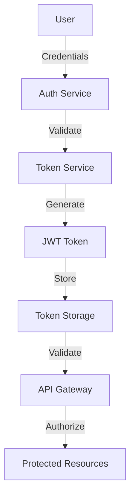
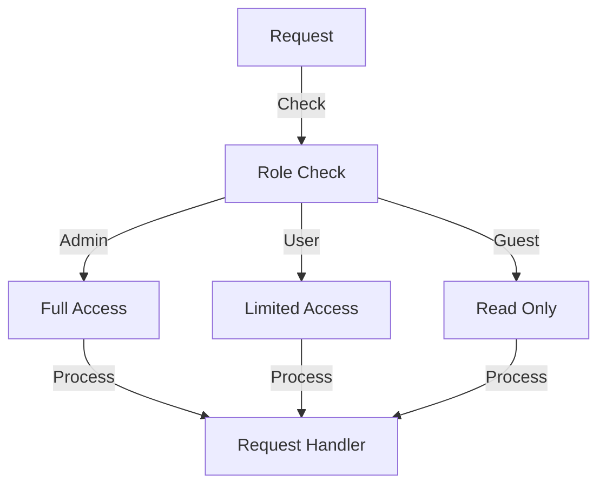
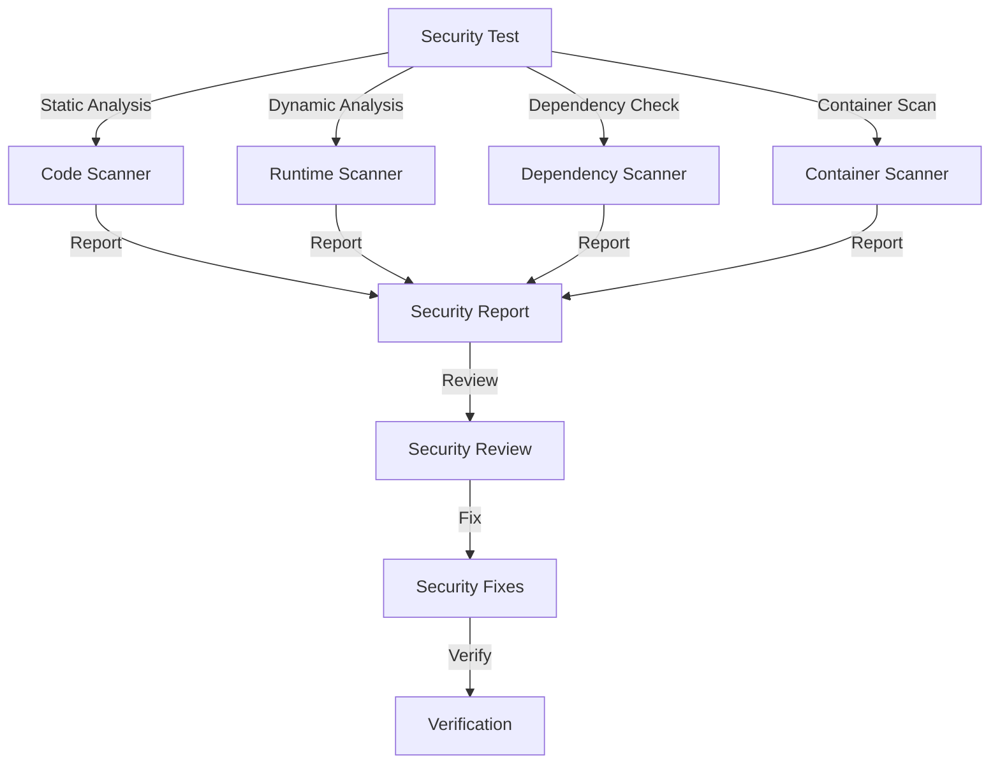
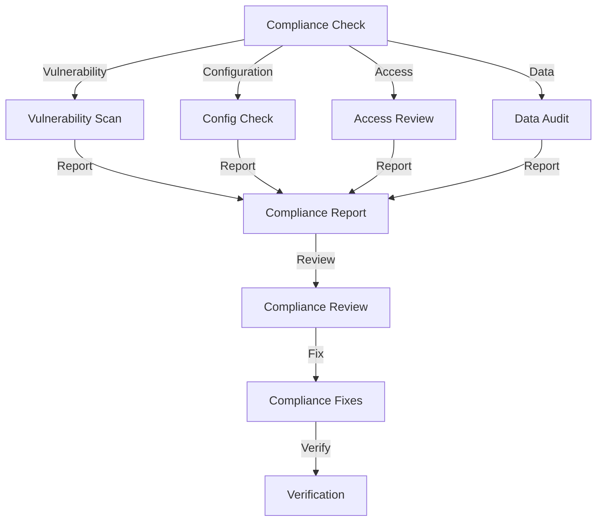
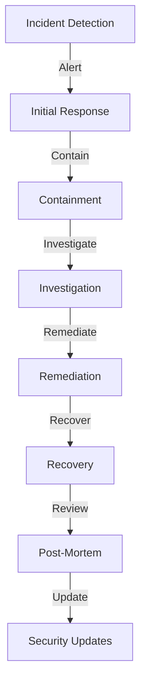
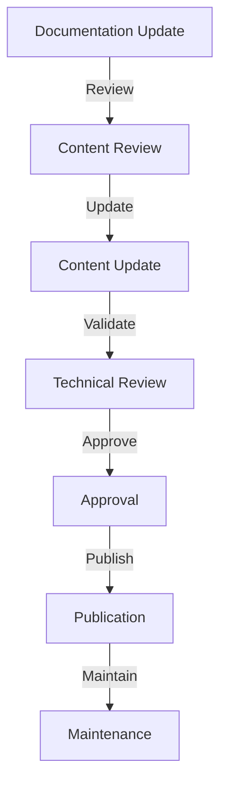
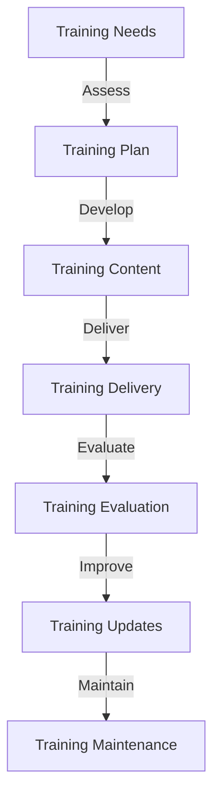
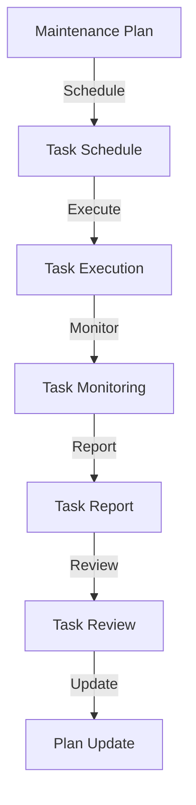

# DiscoMachina Security Documentation

## Overview

This document outlines the security measures, protocols, and best practices implemented in DiscoMachina to ensure the protection of data, systems, and user information.

## Security Architecture

### 1. Authentication System



### 2. Authorization System



## Security Components

### 1. Authentication

```python
class Authentication:
    """
    Authentication system implementation.
    """
    
    def __init__(self):
        self.methods = {
            "jwt": JWTProvider(),
            "oauth2": OAuth2Provider(),
            "api_key": APIKeyProvider()
        }
        self.policies = {
            "password_policy": {
                "min_length": 12,
                "require_special": True,
                "require_numbers": True,
                "require_uppercase": True,
                "require_lowercase": True
            },
            "token_policy": {
                "expiry": "24h",
                "refresh_interval": "1h",
                "max_refresh_count": 5
            }
        }
```

### 2. Authorization

```python
class Authorization:
    """
    Authorization system implementation.
    """
    
    def __init__(self):
        self.roles = {
            "admin": {
                "permissions": ["*"],
                "resources": ["*"]
            },
            "user": {
                "permissions": ["read", "write"],
                "resources": ["projects", "tasks"]
            },
            "guest": {
                "permissions": ["read"],
                "resources": ["projects"]
            }
        }
        self.policies = {
            "rbac": RBACPolicy(),
            "abac": ABACPolicy(),
            "pbac": PBACPolicy()
        }
```

## Security Protocols

### 1. Data Protection

```python
class DataProtection:
    """
    Data protection implementation.
    """
    
    def __init__(self):
        self.encryption = {
            "at_rest": AES256Encryption(),
            "in_transit": TLS1_3(),
            "key_management": KMS()
        }
        self.data_classification = {
            "public": ["project_name", "description"],
            "private": ["api_keys", "credentials"],
            "confidential": ["user_data", "payment_info"]
        }
```

### 2. Network Security

```python
class NetworkSecurity:
    """
    Network security implementation.
    """
    
    def __init__(self):
        self.protocols = {
            "tls": TLS1_3(),
            "vpn": OpenVPN(),
            "firewall": IPTables()
        }
        self.policies = {
            "rate_limiting": {
                "requests_per_minute": 100,
                "requests_per_hour": 1000,
                "requests_per_day": 10000
            },
            "ip_whitelist": ["trusted_ips"],
            "ip_blacklist": ["blocked_ips"]
        }
```

## Security Measures

### 1. Input Validation

```python
class InputValidation:
    """
    Input validation implementation.
    """
    
    def __init__(self):
        self.validators = {
            "string": StringValidator(),
            "number": NumberValidator(),
            "email": EmailValidator(),
            "url": URLValidator(),
            "json": JSONValidator()
        }
        self.sanitizers = {
            "html": HTMLSanitizer(),
            "sql": SQLSanitizer(),
            "xss": XSSSanitizer()
        }
```

### 2. Output Encoding

```python
class OutputEncoding:
    """
    Output encoding implementation.
    """
    
    def __init__(self):
        self.encoders = {
            "html": HTMLEncoder(),
            "json": JSONEncoder(),
            "xml": XMLEncoder(),
            "url": URLEncoder()
        }
        self.policies = {
            "content_security": {
                "allowed_sources": ["self", "trusted_domains"],
                "allowed_scripts": ["self", "trusted_scripts"],
                "allowed_styles": ["self", "trusted_styles"]
            }
        }
```

## Security Monitoring

### 1. Logging System

```python
class SecurityLogging:
    """
    Security logging implementation.
    """
    
    def __init__(self):
        self.loggers = {
            "access": AccessLogger(),
            "audit": AuditLogger(),
            "error": ErrorLogger(),
            "security": SecurityLogger()
        }
        self.storage = {
            "local": LocalStorage(),
            "cloud": CloudStorage(),
            "archive": ArchiveStorage()
        }
```

### 2. Monitoring System

```python
class SecurityMonitoring:
    """
    Security monitoring implementation.
    """
    
    def __init__(self):
        self.monitors = {
            "intrusion": IntrusionDetector(),
            "anomaly": AnomalyDetector(),
            "threat": ThreatDetector(),
            "vulnerability": VulnerabilityScanner()
        }
        self.alerts = {
            "email": EmailAlert(),
            "sms": SMSAlert(),
            "webhook": WebhookAlert()
        }
```

## Security Testing

### 1. Testing Tools

```python
class SecurityTesting:
    """
    Security testing implementation.
    """
    
    def __init__(self):
        self.scanners = {
            "static": StaticCodeScanner(),
            "dynamic": DynamicScanner(),
            "dependency": DependencyScanner(),
            "container": ContainerScanner()
        }
        self.testers = {
            "penetration": PenetrationTester(),
            "vulnerability": VulnerabilityTester(),
            "compliance": ComplianceTester()
        }
```

### 2. Testing Process



## Security Compliance

### 1. Compliance Standards

```python
class SecurityCompliance:
    """
    Security compliance implementation.
    """
    
    def __init__(self):
        self.standards = {
            "owasp": OWASPCompliance(),
            "pci": PCICompliance(),
            "gdpr": GDPRCompliance(),
            "hipaa": HIPAACompliance()
        }
        self.checks = {
            "vulnerability": VulnerabilityCheck(),
            "configuration": ConfigurationCheck(),
            "access": AccessCheck(),
            "data": DataCheck()
        }
```

### 2. Compliance Process



## Security Best Practices

### 1. Code Security

```python
class CodeSecurity:
    """
    Code security best practices.
    """
    
    def __init__(self):
        self.practices = {
            "input_validation": {
                "validate_all_inputs": True,
                "use_parameterized_queries": True,
                "escape_output": True
            },
            "authentication": {
                "use_strong_passwords": True,
                "implement_2fa": True,
                "session_management": True
            },
            "authorization": {
                "principle_of_least_privilege": True,
                "role_based_access": True,
                "resource_based_access": True
            }
        }
```

### 2. Data Security

```python
class DataSecurity:
    """
    Data security best practices.
    """
    
    def __init__(self):
        self.practices = {
            "encryption": {
                "encrypt_at_rest": True,
                "encrypt_in_transit": True,
                "key_rotation": True
            },
            "storage": {
                "secure_storage": True,
                "backup_encryption": True,
                "data_classification": True
            },
            "access": {
                "access_logging": True,
                "audit_trails": True,
                "data_masking": True
            }
        }
```

## Security Incident Response

### 1. Incident Management

```python
class IncidentManagement:
    """
    Security incident management.
    """
    
    def __init__(self):
        self.process = {
            "detection": {
                "monitoring": True,
                "alerts": True,
                "logging": True
            },
            "response": {
                "containment": True,
                "investigation": True,
                "remediation": True
            },
            "recovery": {
                "backup_restore": True,
                "system_recovery": True,
                "service_restore": True
            }
        }
```

### 2. Incident Process



## Security Documentation

### 1. Documentation Requirements

```python
class SecurityDocumentation:
    """
    Security documentation requirements.
    """
    
    def __init__(self):
        self.requirements = {
            "policies": {
                "security_policy": True,
                "access_policy": True,
                "data_policy": True
            },
            "procedures": {
                "incident_response": True,
                "change_management": True,
                "access_management": True
            },
            "standards": {
                "coding_standards": True,
                "security_standards": True,
                "compliance_standards": True
            }
        }
```

### 2. Documentation Process



## Security Training

### 1. Training Program

```python
class SecurityTraining:
    """
    Security training program.
    """
    
    def __init__(self):
        self.program = {
            "awareness": {
                "security_basics": True,
                "threat_awareness": True,
                "best_practices": True
            },
            "technical": {
                "secure_coding": True,
                "security_tools": True,
                "incident_response": True
            },
            "compliance": {
                "regulatory_requirements": True,
                "company_policies": True,
                "audit_procedures": True
            }
        }
```

### 2. Training Process



## Security Maintenance

### 1. Maintenance Tasks

```python
class SecurityMaintenance:
    """
    Security maintenance tasks.
    """
    
    def __init__(self):
        self.tasks = {
            "updates": {
                "security_patches": True,
                "dependency_updates": True,
                "tool_updates": True
            },
            "monitoring": {
                "system_monitoring": True,
                "log_analysis": True,
                "performance_monitoring": True
            },
            "audit": {
                "security_audit": True,
                "compliance_audit": True,
                "access_audit": True
            }
        }
```

### 2. Maintenance Process



## Best Practices Summary

1. **Authentication & Authorization**
   - Implement strong authentication
   - Use role-based access control
   - Regular access reviews
   - Secure session management

2. **Data Protection**
   - Encrypt sensitive data
   - Secure data storage
   - Regular backups
   - Data classification

3. **Network Security**
   - Use secure protocols
   - Implement firewalls
   - Regular security updates
   - Network monitoring

4. **Application Security**
   - Input validation
   - Output encoding
   - Secure coding practices
   - Regular security testing

5. **Monitoring & Logging**
   - Comprehensive logging
   - Real-time monitoring
   - Alert systems
   - Audit trails

6. **Incident Response**
   - Incident detection
   - Response procedures
   - Recovery plans
   - Post-mortem analysis

7. **Compliance**
   - Regular compliance checks
   - Policy updates
   - Documentation
   - Training programs

8. **Maintenance**
   - Regular updates
   - Security patches
   - System monitoring
   - Performance optimization 